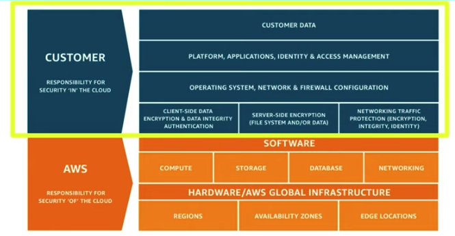
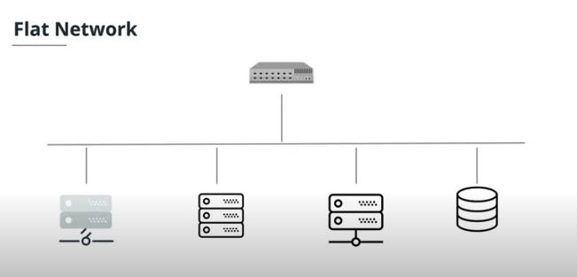
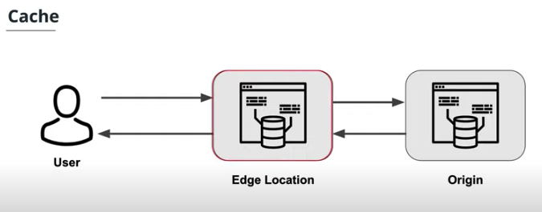

#### Lesson 1: Cloud Computing

##### 4. What is Cloud Computing

**Cloud Computing**
Cloud Computing is the delivery of IT resources over the Internet. The cloud is like a virtual data center accessible via the Internet that allows you to manage:
Storage services likes databases
Servers, compute power, networking
Analytics, artificial intelligence, augmented reality
Security services for data and applications

**Characteristics of Cloud Computing**
Pay as you go - You pay only for what you use and only when your code runs.
Autoscaling - The number of active servers can grow or shrink based on demand.
Serverless - Allows you to write and deploy code without having to worry about the underlying infrastructure.

##### 5. Types of Cloud Computing

**Infrastructure-as-a-Service (IaaS)**
The provider supplies virtual server instances, storage, and mechanisms for you to manage servers. For example `Rackspace`.

**Platform-as-a-Service (PaaS)**
A platform of development tools hosted on a provider's infrastructure. For example `Godday`.

**Software-as-a-Service (SaaS)**
A software application that runs over the Internet and is managed by the service provider. For example: `Gmail`.

#### 6. Cloud Deployment Models

**Public Cloud**
A public cloud makes resources available over the Internet to the general public.

**Private Cloud**
A private cloud is a proprietary network that supplies services to a limited number of people. "On-premises" BEST describes a private cloud.

**Hybrid Cloud**
A hybrid model contains a combination of both a public and a private cloud.
The hybrid model is a growing trend in the industry for those organizations that have been slow to adopt the cloud due to being in a heavily regulated industry. The hybrid model gives organizations the flexibility to slowly migrate to the cloud.

#### 7. Common Benefits

There are several benefits to the cloud.

- Stop guessing about capacity.
- Avoid huge capital investments up front.
- Pay for only what you use.
- Scale globally in minutes.
- Deliver faster.

#### 9. Services

Cloud Based Products
Amazon Web Services offers a broad set of global cloud-based products.

Analytics

- Quick Sight
- Athena
- Redshift

Application integration

- Simple Queue Service (SQS)
- Simple Notification Service (SNS)
  Cost management
- AWS Budgets

Compute services

- Elastic Cloud Compute (EC2)
- Lambda
- Elastic Beanstalk

Database management services

- MySQL
- Oracle
- SQLServer
- DynamoDB
- MongoDB

Developer tools

- Cloud 9
- Code Pipeline
  Security services
- Key Management Service (KMS)
- Shield
- Identity and Access Management (IAM)

Additional Services

- Blockchain
- Machine Learning
- Computer Vision
- Internet of Things (IoT)
- AR/VR

#### 10. Global Infrastructure

**Region**
A region is considered a geographic location or an area on a map.

**Availability Zone**
An availability zone is an isolated location within a geographic region and is a physical data center within a specific region.

**Edge Location**
An edge location is as a mini-data center used solely to cache large data files closer to a user's location.

**Additional Information**

- There are more Availability Zones (AZs) than there are Regions.
- There should be at least two AZs per Region.
- Each region is located in a separate geographic area.
- AZs are distinct locations that are engineered to be isolated from failures.

#### 11. Shared Responsibility Model

AWS is responsible for security **OF** the cloud, and provide tools that we need to secure our system. we are responsible for security **IN** the cloud.

Examples

**AWS is responsible for:**

- Securing edge locations
- Monitoring physical device security
- Providing physical access control to hardware/software
- Database patching
- Discarding physical storage devices

**You are responsible for:**

- Managing AWS Identity and Access Management (IAM)
- Encrypting data
- Preventing or detecting when an AWS account has been compromised
- Restricting access to AWS services to only those users who need it

#### Lesson 2: Foundational & Compute Service

Servers in the cloud have revolutionized the IT industry.

- Scale capacity up and down based on demands.
- Storage, more memory, and computing power can be added as needed.
- Obtain servers in minutes.
- No need for onsite hardware or capital expenses.

#### 3. Elastic Cloud Compute

Elastic Cloud Compute or **EC2** is a foundational piece of AWS' cloud computing platform, and is a service that provides servers for rent in the cloud.

**Pricing Options**
There are several pricing options for EC2.

- On Demand - Pay as you go, no contract.
- Dedicated Hosts - You have your **own dedicated hardware** and don't share it with others.
- Spot - You place a **bid on an instance price**. If there is extra capacity that falls below your bid, an EC2 instance is provisioned. If the price goes above your bid while the instance is running, the instance is terminated.
- Reserved Instances - You earn huge discounts if you pay up front and sign a **1-year or 3-year contract**.

Tips

- EC2 is found under the Compute section of the AWS Management Console.
- Spot instances can save you up to 90% off the on-demand pricing.
- There are several instance types that provide varying combinations of CPU, memory, storage, and networking capacity.

#### 5. Elastic Block Store (EBS)

Elastic Block Store (EBS) is a storage solution for EC2 instances and is a physical hard drive that is attached to the EC2 instance to increase storage.

Tips

- EBS is found on the EC2 Dashboard.
- There are several EBS volume types that fall under the categories of Solid State Drives (SSD) and Hard Disk Drives (HDD).

Benefits:

- Persist data after instance terminated.
- Automatically replicated within its Availability Zone.

#### 7. Why do we need security in the cloud for our servers?

Security in the cloud allows you to have complete control over your virtual networking environment.

- Configure your virtual network with public or private facing subnets
- Launch your servers in the selected network to secure access

#### 8. Virtual Private Cloud (VPC)

Topically when you create resources, they are on a flat network that shared among various AWS users. This will help you to reduce admin cost.

Virtual Private Cloud or **VPC** allows you to create your own private network in the cloud. You can launch services, like EC2, inside of that private network. This is done as a security measure. We expose what we do or do not expose to the internet to the public or private subnets.

A VPC spans all the Availability Zones in the region.

VPC allows you to control your virtual networking environment, which includes:

- IP address ranges
- subnets
- route tables
- network gateways

Tips

- VPC is found under Networking & Content Delivery section of the AWS Management Console.
- The default limit is **5 VPCs per Region**. You can request an increase for these limits.
- Your AWS resources are automatically provisioned in a default VPC.
- There are **no additional charges** for creating and using the VPC.
- You can store data in Amazon S3 and restrict access so that it’s only accessible from instances in your VPC.

#### 11. Why do we need compute power in the cloud?

Compute power in the cloud is a faster way to build applications, providing:

- no servers to manage (i.e. serverless)
- automatically scale
- ability to run code on demand in response to events
- high availability and fault tolerance
- pay only when your code runs
- developer focus on writing code

#### 12. Lambda

AWS Lambda provides you with computing power in the cloud by allowing you to **execute code without standing up or managing servers**. Lambda should focus on 1 task (15 minutes timeout).

Tips

- Lambda is found under the Compute section on the AWS Management Console.
- Lambdas have a time limit of 15 minutes.
- The code you run on AWS Lambda is called a “Lambda function.”
- Lambda code can be triggered by other AWS services.
- AWS Lambda supports Java, Go, PowerShell, Node.js, C#/.NET, Python, and Ruby. There is a Runtime API that allows you to use other programming languages to author your functions.
- Lambda code can be authored via the console.

Serverless:

- no concern for servers
- pay only when your code runs
- author locally or directly via console
- event-driven code

#### 15. Elastic Beanstalk

**Elastic Beanstalks** is an orchestration service that allows you to deploy a web application at the touch of a button by spinning up (or provisioning) all of the services that you need to run your application.

Process

- EC2
- Auto-scaling
- Elastic load balancer
- Services like database, VPCs and Security Groups

Tips

- Elastic Beanstalk is found under the Compute section of the AWS Management Console.
- Elastic Beanstalk can be used to deployed web applications developed with Java, .NET, PHP, Node.js, Python, Ruby, Go, and Docker.
- You can run your applications in a VPC.

#### Lesson 3: Storage & Content Delivery

#### 2. Why do we need storage in the cloud?

Storage and database services in the cloud provide a place for companies to `collect, store, and analyze` the data they've collected over the years at a massive scale.

Benefits:

- Durability (Guarantees no data loss): Your data will be there in the future
- Availability (How quickly you can access your data): Fast and reliable
- Scalability (Meet demand seamlessly including Automatically Adding/removing resources and maintain steady state)

Type of Scaling:

- vertical: Scaling up by modifying the server (adding more memory or capacity)
- horizontal: Scaling out by adding or removing servers
- diagonal: combination of vertical and diagonal

Storage & Database Services

- Amazon Simple Storage Service (Amazon S3)
- Amazon Simple Storage Service (Amazon S3) Glacier
- DynamoDB
- Relational Database Service (RDS)
- Redshift
- ElastiCache
- Neptune
- Amazon DocumentDB

#### 3. S3 & Glacier

Amazon Simple Storage Service (or S3) is an object storage system in the cloud.

Storage Classes
S3 offers several storage classes, which are different data access levels for your data at certain price points.

**Bucket**
All objects are stored in a bucket.
Buckets lives in a region, but bucket name must be globally unique.

**Durability & Scalability**

- Durability of 99.99999999%
- Multiple availability zones
- Availability of 99.99%

- S3 Standard
- S3 Glacier
- S3 Glacier Deep Archive
- S3 Intelligent-Tiering
- S3 Standard Infrequent Access
- S3 One Zone-Infrequent Access

Tips

- A single object can be up to 5 terabytes in size.
- You can enable Multi-Factor Authentication (MFA) Delete on an S3 bucket to prevent accidental deletions.
- **S3 Acceleration** can be used to enable fast, easy, and secure transfers of files over long distances between your data source and your S3 bucket.

#### 5. DynamoDB

DynamoDB is a NoSQL document database service that is fully managed. Unlike traditional databases, NoSQL databases, are schema-less. Schema-less simply means that the database doesn't contain a fixed (or rigid) data structure, which offers great flexibility.

NoSQL is great for quickly scale and handle large amounts of data. Traditional database don't handle that type of load or scale that well.

Each row, or record, is called **A Document**

Tips

- DynamoDB can handle more than 10 trillion requests per day.
- DynamoDB is fully managed serverless as there are no servers to provision, patch, or manage.
- DynamoDB supports key-value and document data models.
- DynamoDB synchronously replicates data across three AZs in an AWS Region.
- DynamoDB supports GET/PUT operations using a primary key.
- **Global Table** can exists in 2 or more AWS regions with automatic replication.

#### 8. Relational Database Service (RDS)

RDS (or Relational Database Service) is a service that aids in the administration and management of databases. RDS assists with database administrative tasks that include upgrades, patching, installs, backups, monitoring, performance checks, security, etc.

Database Engine Support

- Oracle
- PostgreSQL
- MySQL
- MariaDB
- SQL Serve

Features

- failover
- backups
- restore
- encryption
- security
- monitoring
- data replication
- scalability

#### 10. Redshift

Redshift is a cloud data warehousing service to help companies manage big data. Redshift allows you to run fast queries against your data using SQL, ETL, and BI tools. Redshift stores data in a column format to aid in fast querying.

Features:

- Fast query and analysis
- Not transaction processing
- Historical data. For example: for an online ordering system, recent transaction placed in relational database, but old orders archived are saved in data warehouse like RedShift

Tips

- Redshift delivers great performance by using machine learning.
- Redshift Spectrum is a feature that enables you to run queries against data in Amazon S3.
- Redshift encrypts and keeps your data secure in transit and at rest.
- Redshift clusters can be isolated using Amazon Virtual Private Cloud (VPC).

#### 12. Why do we need content delivery in the cloud?

A Content Delivery Network (or CDN) speeds up delivery of your static and dynamic web content (like html, images, css, JavaScript logics), by caching content in an Edge Location close to your user base.

Benefits
The benefits of a CDN includes:

- low latency
- decreased server load
- better user experience

#### 13. Cloud Front

CloudFront is used as a global content delivery network (CDN). Cloud Front speeds up the delivery of your content through Amazon's worldwide network of mini-data centers called **Edge Locations**.

You can configure how long a item remain cached before refresh, or you can manually expire or remove item from cache when item needs to be changed.

CloudFront works with other AWS services, as shown below, as an origin source for your application:

- Amazon S3
- Elastic Load Balancing
- Amazon EC2
- Lambda@Edge
- AWS Shield

Tips

- Amazon continuously adds new Edge Locations.
- CloudFront ensures that end-user requests are served from the closest edge location.
- CloudFront works with non-AWS origin sources.
- You can use GeoIP blocking to serve content (or not serve content) to specific countries.
- Cache control headers determine how frequently CloudFront needs to check the origin for an updated version your file.
- The maximum size of a single file that can be delivered through Amazon CloudFront is 20 GB.

#### Lesson 4: Security

#### 2. Why do we need security for applications?

Security In The Cloud
As adoption of cloud services has increased, so has the need for increased security in the cloud. The great thing about cloud security is that it not only protects data, it also protects applications that access the data. Cloud security even protects the infrastructure (like servers) that applications run on.

The way security is delivered depends on the cloud provider you're using and the cloud security options they offer.

Protection:

- Protects data, especially PII (Personally identifiable information such as back account or Social Security Number)
- Protects applications that access data
- Protects infrastructure that the application is run on

#### 3. AWS Shield

AWS Shield is a managed DDoS (or Distributed Denial of Service) protection service that safeguards web applications running on AWS.

**DDoS** is an attempt to make a website or application unavailable by overwhelming it with traffic from multiple sources.

AWS Shield is a service that you get "out of the box", it is **always running (automatically)** and is a part of the free standard tier. If you want to use some of the more advanced features, you'll have to utilize the paid tier

#### 4. AWS Web Application Firewall

AWS WAF (or AWS Web Application Firewall) provides a firewall that protects your web applications.

AWS WAF monitors and controls incoming and outgoing traffics based on preset security rules.

WAF can stop common web attacks by reviewing the data being sent to your application and stopping well-known attacks, such as SQL injection and Cross-site scripting.

Tips

- WAF is found under the Security, Identity, & Compliance section on the AWS Management Console.
- WAF can protect web sites not hosted in AWS through Cloud Front.
- You can configure CloudFront to present a custom error page when requests are blocked.

#### 5. Identity and Access Management (IAM)

Identity & Access Management (IAM) is an AWS service that allows us to configure who can access our AWS account, services, or even applications running in our account. IAM is a global service and is automatically available across ALL regions.

Security Concepts

- User: An entity to represent a person or services that interacts with services or applications running in your AWS account. An user in AWS consists of a user name and access credentials, like console password, or access key, which includes an access key ID and a secret access key.
- IAM Group: A collection of users, you can specify permissions for a collection which makes permissions easier to manage.
- IAM Role: A role is an identity with permissions, or a set of privileges that are not associated with a specific IAM user or IAM group. Role can be attached to a user, and a user can assume a single role temporarily to preform a specific task.
- Policy: A policy is a way to define granular level permissions and can be attached to users, groups and roles. AWS provides a list of pre-defined policies. Additionally you can create your own custom policies using JSON.

EC2 Security Group is not a part of IAM, and it is different from IAM security group.

- EC2 security groups are associated with an EC2 instance, and act as a built-in firewall for your VM to either allow or deny access.
- IAM security groups are a collection of users, you can specify permissions for a collection which makes permissions easier to manage.

#### Lesson 5: Networking & Elasticity

#### 2. Why do we need networking in the cloud?

Networks reliably carry loads of data around the globe allowing for the delivery of content and applications with high availability. The network is the foundation of your infrastructure.

Cloud networking includes:

- network architecture
- network connectivity: includes services that offer reliable and cost-effective ways to route end-users to Internet applications.
- application delivery
- global performance
- delivery

#### 3. Route 53

Route 53 is AWS cloud domain name system (DNS) service that has servers distributed around the globe used to translates human-readable names like www.google.com into the numeric IP addresses like 74.125.21.147.

Features

- scales automatically to manage spikes in DNS queries
- allows you to register a domain name (or manage an existing)
- routes internet traffic to the resources for your domain
- checks the health of your resources, which ensure that your web servers are up and running and offer DNS failover to automatically route your web visotprs to an alternate location to avoid site outrage.

Tips

- Route 53 is found under the Networking & Content Delivery section on the AWS Management Console.
- Route 53 allows you to route users based on the user’s geographic location.

#### 4. Why do we need elasticity in the cloud?

One of the main benefits of the cloud is that it allows you to stop guessing about capacity when you need to run your applications. Sometimes you buy too much or you don't buy enough to support the running of your applications.

With elasticity, your servers, databases, and application resources can automatically scale up or scale down based on load.

Resources can scale up (or vertically). In Amazon EC2, this can easily be achieved by stopping an instance and resizing it to an instance type that has more RAM, CPU, IO.
Or you can scale out (or horizontally), which increases the number of resources. An example would be adding more servers.

#### 5. EC2 Auto Scaling

EC2 Auto Scaling is a service that **monitors your EC2 instances** and automatically adjusts by adding or removing EC2 instances based on conditions you define in order to maintain application availability and provide peak performance to your users.

EC2 Auto Scaling works with AWS messaging service like the SNS to alert you when EC2 Auto Scaling is adding or removing your EC2 instances.

AWS Auto Scaling service is different with EC2 Auto Scaling, which allows to scale other services like DynamoDB to automatically scale.

Features

- Automatically scale in and out based on needs.
- Included automatically with Amazon EC2.
- Automate how your Amazon EC2 instances are managed.

Tips

- EC2 Auto Scaling is found on the EC2 Dashboard.
- EC2 Auto Scaling adds instances only when needed, optimizing cost savings.
- EC2 predictive scaling removes the need for manual adjustment of auto scaling parameters over time.

#### 7. Elastic Load Balancing

Elastic Load Balancing automatically distributes incoming application traffic across multiple servers.

Elastic Load Balancer is a service that:

- Balances load between two or more servers
- Stands in front of a web server
- Provides redundancy and performance. Redundancy simply means that if you lose a server, the load balancer will send requests to other working servers. This feature maintains continuous operations in an emergency. Good performance simply means that if a server starts having issues or bottlenecks, the load balancer will add more servers to the pool of available servers. Auto scaling automatically adjusts capacity to maintain a steady state.

#### Lesson 6: Messaging & Container

#### 2. Why do we need messaging in the cloud?

There are often times that users of your applications need to be notified when certain events happen. Notifications, such as text messages or emails can be sent through services in the cloud. The use of the cloud offers benefits like lowered costs, increased storage, and flexibility.

Messaging is a form of notification, it typically occurs between Internet-based applications and devices, one system can send a message to another system.

#### 3. Simple Notification Service (SNS)

Amazon Simple Notification Service (or SNS) is AWS cloud service that allows you to send notifications to the users of your applications. SNS allows you to decouple the notification logic from being embedded in your applications and allows notifications to be published to a large number of subscribers.

An Amazon SNS **topic** is a logical access point that acts as a communication channel. A topic lets you group multiple endpoints (such as AWS Lambda, Amazon SQS, HTTP/S, or an email address).

Features

- SNS uses a publish/subscribe model. In order for your users to be notified, they have to sign up or subscribe first. Subscribers can be a person or another AWS service.
- SNS can publish messages to Amazon SQS queues, AWS Lambda functions, and HTTP/S webhooks.

Tips

- SNS is found under the Application Integration section on the AWS Management Console.
- SNS Topic names are limited to 256 characters.
- A notification can contain only one message.
- Notifications can be sent to end-users using mobile push, text-message or email.

#### 5. Why do we need queuing technology?

A queue is a data structure that holds requests called messages.

Messages in a queue are commonly processed in order, first in, first out (or FIFO).

Queue supports asynchronous processing, where a user doesn't wait for a response, improves the overall user experience.

Messaging queues improve:

- performance
- scalability
- user experience

#### 6. Simple Queue Service (SQS)

Amazon Simple Queue Service (SQS) is a fully managed message queuing service that allows you to integrate queuing functionality in your application, without losing messages.

SQS offers two types of message queues: standard and FIFO.

FIFO:

- Guarantee the ordering of messages
- Proceed exactly once
- Proceed in the exact order they were added to the queue.

Features

- send messages
- store messages
- receive messages

Tips

- The Simple Queue Service (SQS) is found under the Application Integration on the AWS Management Console.
- FIFO queues support up to 300 messages per second.
- FIFO queues guarantee the ordering of messages, and are processed exactly once.
- **Standard queues offer best-effort ordering but no guarantees**.
- Standard queues deliver a message at least once, but **occasionally more than one copy of a message is delivered**.

#### 9. Why do we need containers?

Enterprises are adopting container technology at an explosive rate.

A container consists of everything an application needs to run: the application itself, and its dependencies (e.g. libraries, utilities, configuration files), all bundled into one package. It is very easy to move from environment to other environment (say from Dev to UAT to Prod), don't have to rebuild, just move the entire container.

Each container is an independent component that can run on its own and be moved from environment to environment.

#### 10. Elastic Container Service (ECS)

ECS is an orchestration service used for automating deployment, scaling, and managing of your containerized applications. ECS works well with Docker containers by:

- launching and stopping Docker containers
- scaling your applications
- querying the state of your applications

**Task Definition** is an application blueprint that describe the container information for your application.
A **cluster** is a set of container instances running the container agent.

Tips

- ECS is under the Compute section on the AWS Management Console.
- You can schedule long-running applications, services, and batch processeses using ECS.
- Docker is the only container platform supported by Amazon ECS.

#### Lesson 7: AWS Management

#### 2. Why do we need logging and auditing in the cloud?

Logging provides visibility into your cloud resources and applications. For applications that run in the cloud, you will need access to logging and auditing services to help you proactively monitor your resources and applications.

Logging allows you to answer important questions like:

How is this server performing?
What is the current load on the server?
What is the root cause of an application error that a user is seeing?
What is the path that leads to this error?

#### 3. Cloud Trail

Cloud Trail allows you to **audit (or review) everything that occurs in your AWS account**. Cloud Trail does this by recording all the AWS API calls occurring in your account and delivering a log file to you.

Features
CloudTrail provides event history of your AWS account activity, including:

- who has logged in
- services that were accessed
- actions performed
- parameters for the actions
- responses returned

This includes actions taken **through the AWS Management Console, AWS SDKs, command line tools, and other AWS services**.

Tips

- Cloud Trail is found under the Management & Governance section on the AWS Management Console.
- CloudTrail shows results for the last 90 days.
- Cloud Trail events can only be process by one trail for free.
- You can create up to five trails in an AWS region.

#### 5. Cloud Watch

Cloud Watch is a service that monitors resources and applications that run on AWS by collecting data in the form of logs, metrics, and events.

Features
There are several useful features:

- Collect and track metrics
- Collect and monitor log files
- Set alarms and create triggers to run your AWS resources
- React to changes in your AWS resources

Tips

- CloudWatch is found under the Management & Governance section on the AWS Management Console.
- Metrics are provided automatically for a number of AWS products and services.

#### 8. What is Infrastructure as Code and why do we need it?

Infrastructure as Code allows you to describe and provision all the infrastructure resources in your cloud environment. You can stand up servers, databases, runtime parameters, resources, etc. based on scripts that you write. Infrastructure as Code is a time-saving feature because it allows you to provision (or stand up) resources in a reproducible way.

#### 9. Cloud Formation

AWS Cloud Formation allows you to model your entire infrastructure in a text file template allowing you to provision AWS resources based on the scripts you write.

Tips

- Cloud Formation is found under the Management & Governance section on the AWS Management Console.
- Cloud Formation templates are written using JSON or YAML.
- You can still individually manage AWS resources that are part of a CloudFormation stack.

#### 12. AWS Command Line Interface (CLI)

The AWS CLI (or Command Line Interface) allows you to access and control services running in your AWS account from the command line. To use the CLI, simply download, install, and configure it.

The AWS CLI allows you to work with AWS services in a programmatic manner.
