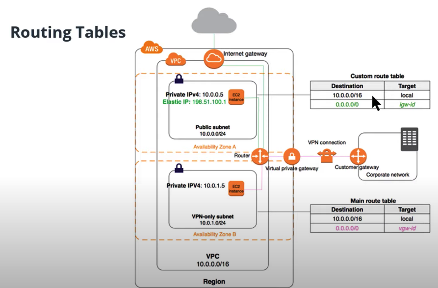
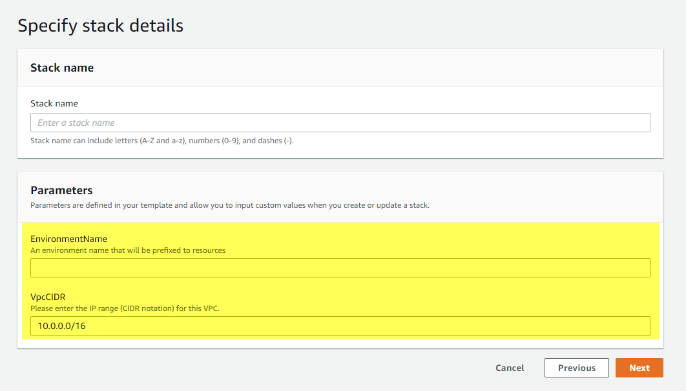

#### Lesson 1: Getting Started with Cloud Formation

#### 3. What is DevOps

DevOps is the combination of industry best practices, and set of tools that improve an organization’s ability to:

- Increase the speed of software delivery
- Increases the speed of software evolution
- Have better reliability of the software
- Have scalability using automation,
- Improved collaboration among teams.

In other words, these tools enable a company to showcase industry best practices in software development.

#### 4. Why you need DevOps

Issues that DevOps tries to solve:

- Unpredictable deployments
- Mismatched environments (development doesn’t match production)
- Configuration Drift

#### 5. What are the benefits of Cloud DevOps?

DevOps best practices and tools
One of the benefits of using DevOps is that it allows predictable deployments using automated scripts. In the DevOps model, development and operations teams are merged into a single team. These DevOps teams use a few tools and best practices that deploy and manage configuration changes to servers.

The most important practices are:

- Continuous Integration / Continuous Delivery (CI/CD) - new features are automatically deployed with all the required dependencies.
- Infrastructure as Code (IaaC) - configuration and management of cloud infrastructure using re-usable scripts.

Other prevalent practices are:

- Microservices
- Monitoring and Logging
- Communication and Collaboration

Glossary

1. **Continuous Integration Continuous Deployment (CI/CD)**: Tracks the development workflow from testing through production. Continuous integration is the process flow of testing any change made to your development flow, while continuous deployment tracks those changes through to staging and production systems. You may like to read this article by Atlassian.com that describes CI/CD in detail.

2. **Infrastructure as code (IaaC)**: Provision and manages the cloud-infrastructure by using scripts. These scripts can be written in YAML or JSON format. These scripts ensure that the same architecture can be re-built multiple numbers of times. These scripts are particularly useful in enterprise applications and different environments - dev, prod, or test. Read more here.

3. **CloudFormation**: CloudFormation is a tool in AWS for managing, configuring and deploying infrastructure (push code along with the necessary server configurations).

#### 7. Creating Access Key ID for IAM User

When creating IAM user, you don't need to specify region, as IAM Users are global.

Deciding Access Privileges within AWS

##### Programmatic Access

In the AWS console, choose "programmatic access." This allows us to use code to interact with AWS, instead of relying on mouse clicking in the console web pages.

##### dministrator Access

For IAM access, choose “administrator access.” This is just for initial setup of your account. Afterwards, you’ll want to limit access to only what you need.

##### Dev and Prod user accounts

In practice, Dev and DevOps members may have separate user accounts for the dev environment as opposed to the production environment. This makes it easier for developers by giving them wider privileges in the dev environment that would normally only be reserved for DevOps members in the production environment.

##### Access Key ID and Secret Access Keys

Remember not to save these in your code or to check into any repositories. Keep these private to you.

#### Configuring AWS CLI

- Be sure to rotate your keys every 90 days
- Disable or delete unused ones and save them in a good location, such as AWS’s own Parameter Store.

#### 9. Adding Additional Keys

Additional Access Keys
Note that each user can have up to 2 access keys at the same time.

Why Making Keys Inactive is a Better Choice
You may make your access key temporarily inactive rather than destroying it and creating a new one. This may be helpful if you want to stop an automated process that uses that key (for example, a CI/CD process).

#### 10. Understanding CloudFormation

CloudFormation

- CloudFormation is a declarative language, not an imperative language.
- CloudFormation handles resource dependencies so that you don’t have to specify which resource to start up before another. There are cases where you can specify that a resource depends on another resource, but ideally, you’ll let CloudFormation take care of dependencies.
- VPC is the smallest unit of resource.

Glossary
**Declarative languages**: These languages specify what you want, without requiring you to specify how to get it. An example of a popular declarative language is SQL.
**Imperative languages**: These languages use statements to change the state of the program.
Additional resources:

#### 11. Getting Started With CloudFormation Script

Having scripts specific for networking and other scripts specific to EC2 Servers or Databases keep your scripts small, and easily shared across teams with different skill sets, such as database administrators and network experts.

YAML and JSON

- YAML and JSON file formats are both supported in CloudFormation, but YAML is the industry preferred version that’s used for AWS and other cloud providers (Azure, Google Cloud Platform).

- An important note about YAML files: the whitespace indentation matters! We recommend that you use four white spaces for each indentation.

Glossary in CloudFormation scripts
**Name**: A name you want to give to the resource (does this have to be unique across all resource types?)

**Type**: Specifies the actual hardware resource that you’re deploying.

**Properties**: Specifies configuration options for your resource. Think of these as all the drop-down menus and checkbox options that you would see in the AWS console if you were to request the resource manually.

**Stack**: A stack is a group of resources. These are the resources that you want to deploy, and that are specified in the YAML file.

Best practices
**Coding best practice**: Create separate files to organize your code. You can either create separate files for similar resources or create files for each developer who uses those resources.

#### 12. Testing CloudFormation

Our first cloudformation template:

```yaml
Description: >
  Yang Gu / Udacity
  This template deploys a VPC.
Resources:
  UdacityVPC: # arbitrary name for a resource
    Type: AWS::EC2::VPC
    Properties:
      CidrBlock: 10.0.0.0/16
      EnableDnsHostnames: true
```

For creating stack:

```
aws cloudFormation create-stack --stack-name myFirstStack --template-body file://testcfn.yml
```

For updating stack:

```
aws cloudFormation update-stack --stack-name myFirstStack --template-body file://testcfn.yml
```

For deleting stack:

```
aws cloudFormation delete-stack --stack-name myFirstStack
```

also can be in bash script

```bash
#!/bin/bash

aws cloudformation delete-stack --stack-name $1
```

run

```
./test_delete_stack.sh myFirstStack
```

#### Lesson 2: Infrastructure Diagrams

Diagrams are a very important starting point for planning your cloud infrastructure. DevOps engineers start with a visual representation of the required cloud infrastructure before they turn it into code. This lesson will show you how to interpret these infrastructure diagrams.

#### 2. Generalizing to other cloud providers

https://www.lucidchart.com/
cloudcraft.co

#### 7. Diagramming Availability Zones

Glossary
Availability Zones (AZ): An AZ is a set of one or more data centers (physical building).

Best Practices

- Choose to have more than one availability zone to avoid a single point of failure.
- Include more than one availability zone to design for high availability, .
- You may choose to reduce to one AZ, possibly for prototyping and design for low cost. But it is not recommended for production environments.

#### 9. Virtual Private Cloud

The main attribute of your VPC is the block of IP addresses, or CIDR block.

VPCs provide you with private IP address for your networking resources

A VPC can span over several **multiple Availability Zones**.

Purpose of Having Subnets:

- Create Logical Separation between resources. (Say separate Dev/UAT/Prod)
- Block or Allow access to/from groups of resources
- Provides services to a specific set of resources and not to others

Create subnets and VPCs with future expansion in mind!

Glossary
Virtual Private Cloud (VPC): A virtual private cloud is a pool of networked cloud resources. It can span more than one availability zone.
The equivalent of this would be a data center. However, thanks to availability zones, VPCs can span more than one physical building. This is an amazing feature that protects against real world disasters like electrical failures, fires and similar events.

#### 11. Public vs Private Subnets

Subnets

- A subnet is a subset of the overall VPC network and it only exists in a single availability zone, unlike its parent network, the VPC.
- A subnet contains resources, and can be assigned access rights that apply to all resources within that subnet.
- Subnets can be public or private. Public subnets are accessible to external users. Private subnets are only accessed internally by other resources within your cloud container.

Use IP addresses for routing traffic

- Use IP addresses as the “keys” for routing traffic. We can route traffic to stay within the VPC, or within a particular subnet, for security reasons.
- For example, **a database, a back-end application server or any sensitive data will be placed in a private subnet**. A public server, like a web server, or a load balancer to your web servers, can be placed in a public subnet. - Routing rules applied to a subnet allow us to define access to all resources placed inside that subnet.

#### 13. IGW Internet Gateway

To provide internet access to a VPC:

- Create an IGW
- Attach the IGW to your VPC
- Create a route to the IGW and associated it with your subnets(s)

Software Defined Networking
VPCs and subnets with VPCs called Software Defined Networking. That is, using APIs and already-existing physical infrastructure to create our own networking layer on top, with our own privacy rules, our own routing and our own Private IP Space.

VPN or Virtual Private Network
It is a type of encrypted connectivity that You can setup between your on-premise data center and your Virtual Private Cloud. This allows access in and out of your AWS VPC in a secure manner, across the internet and using internal, Private IP addresses.

DirectConnect
It is a DirectConnect is a physical data line that you can purchase directly from AWS or through a telecommunication service provider to access your AWS Cloud without moving your data traffic across the public internet.

Internet Gateway

- An internet gateway is a resource that enables inbound and outbound traffic from the internet to your VPC.
- An internet gateway allows external users access to communicate with parts of your VPC.
- If you create a private VPC for an application that is internal to your company, you will not need an internet gateway attached at the edge of your VPC.

#### 15. Network Address Translation (NAT) Gateway

It provides **outbound-only** internet gateway for private services to access the internet. This keeps the private service protected from inbound connections, but allows it to connect to the internet in order to perform functions such as downloading software updates. The NAT gateway serves as an intermediary to take a private resource’s request, connect to the internet, and then relay the response back to the private resource without exposing that private resource’s IP address to the public.

**Note**: Place NAT Gateways inside the **public subnets and not the private subnets**. NAT gateways need to be in the public subnet so that they can communicate with the public internet, and handle requests from resources that are in a private subnet.

#### 17. Autoscaling groups

Glossary
Autoscaling group: It is a coherent group of Virtual Machines (EC2 instances) that allows running the exact number of VMs that are required to meet the demand/specification. The autoscaling group can automatically start or stop the servers (EC2 instances) according to the amount of incoming traffic. This behavior of the autoscaling group helps in two ways:

- The consumer pays for the only duration of the servers when they were active.
- The consumer doesn't have to worry about horizontal scaling of servers for a sudden peak in incoming traffic.

Autoscaling group:

- Needs more than one subnet to ensure availability

You can take advantage of the safety and reliability of geographic redundancy by spanning your Auto Scaling group across multiple Availability Zones within a Region and then attaching a load balancer to distribute incoming traffic across those zones. Incoming traffic is distributed equally across all Availability Zones enabled for your load balancer.

**When one Availability Zone becomes unhealthy or unavailable, Amazon EC2 Auto Scaling launches new instances in an unaffected zone**. When the unhealthy Availability Zone returns to a healthy state, Amazon EC2 Auto Scaling automatically redistributes the application instances evenly across all of the zones for your Auto Scaling group. Amazon EC2 Auto Scaling does this by attempting to launch new instances in the Availability Zone with the fewest instances. If the attempt fails, however, Amazon EC2 Auto Scaling attempts to launch in other Availability Zones until it succeeds.

You can expand the availability of your scaled and load-balanced application by adding an Availability Zone to your Auto Scaling group and then enabling that zone for your load balancer. After you've enabled the new Availability Zone, the load balancer begins to route traffic equally among all the enabled zones.

- It can be used for both High Availability and Elasticity. Elasticity is the ability to expand and contract your resources to meed changing demand

Best Practice

- It is recommended that an autoscaling group **spans more than one availability zone, for reliability**.
- If we set the autoscaling group to run one resource, it will run that one resource in one of the availability zones.
- If there is a failure of that resource, the autoscaling group will shut it down in that availability zone and start that same resource in the other availability zone.

#### 19. Load Balancers

Load Balancer

- A load balancer takes incoming traffic and distributes it to two or more resources. For example, it can take inbound user requests to access your website, and it can distribute the requests evenly among two or more servers.
- Another benefit of have load balancer is **health check**.
- **Without** a load balancer, having public-facing servers in more than one AZ would mean that users would have to use a different URL to reach each of the AZs. This can be impractical compared to just a single URL.

Good practice

- Assume we have a set of web-servers in private subnet(s). Then, we must have a Load Balancer that would access our web-servers. These web-servers, in turn, would access the backend database.

#### 21. Security Groups

Security Groups

- Security groups manage traffic at the server level (the resource level). Security Groups aren’t for managing higher-level groups such as subnets, VPC, or user accounts.
- The same security group can be assigned to multiple resources that require the same security access settings defined by that security group.

#### 23. Routing Table

By Routing Table, you can regular to/from of your network.

Routing Table:

- A set of entries or rules associated with one or more of your subnets inside your VPC.
- These rules allow or deny traffic to/from the address ranges that you specify.
- Rules can be as open as the entire world, or restricted to a single IP address.



In above example:

1. Public subnet is using Custom route table. Private subnet is using Main route table.
2. The first entries from both table, means all traffic to 10.0.0.0/16 are local traffic, so private subnet 10.0.1.0/24 and public subnet 10.0.0.0/24 can see each other.
3. For public subnet, other traffic will be directed to igw-id, which is the Internet Gateway sitting at the edge of VPC. So it has public internet access.
4. For private subnet, other traffic will be directed to vgw-id, which is the Virtual Private Gateway at the edge of the VPN connection, which only can visit Corporate Network in the diagram.

#### 25. S3

- An S3 bucket is a public service for users to upload or download files, you cannot put it inside of your VPC.
- Place the S3 service outside of your VPC.

#### 26. Reviewing Our Diagram

From the diagram, the load balancer looks like a single point of entry, possibly single point of failure, it actually will be spears across 2 of your your AZs. (When you create load balancer you need to specify at least 2 AZs.) The same applies for the Internet Gateway and the Routing and the Auto Scaling. Those things you can assume safely that they are not going to fail, because they have multiple copies of those services running behind the scenes for you.

Do not include hostnames and IP Addresses in your cloud diagram. it would be too much clutter and the data can change.

#### 28. Conclusion

Review the AWS Reference Architecture Page
Visit the [AWS Reference Architecture Page](https://aws.amazon.com/architecture/) and study some of the diagrams.

A good example here:

[Hosting WordPress on AWS](https://github.com/aws-samples/aws-refarch-wordpress) is a great example to help you understand how auto-scaling servers keep track of non-database data, such as images, config files, and similar objects, in this particular case by means of external storage (EFS) mounted to the EC2 Servers -- much like the way you would have your personal files and photos in an external USB drive that you can connect to any computer when you need to access them.

#### Lesson 3: Networking Infrastructure

#### Introduction

Project Diagram


Step 01: Creating a VPC

```yaml
Parameters:
  EnvironmentName:
    Description: An environment name that will be prefixed to resources
    Type: String

  VpcCIDR:
    Description: Please enter the IP range (CIDR notation) for this VPC.
    Type: String
    Default: 10.0.0.0/16

Resources:
  myVPC:
    Type: AWS::EC2::VPC
    Properties:
      CidrBlock: !Ref VpcCIDR
      EnableDnsSupport: true
      Tags:
        - Key: Name
          Value: !Ref EnvironmentName
```

You can verify it in CloudFormation and see if there is any error:

