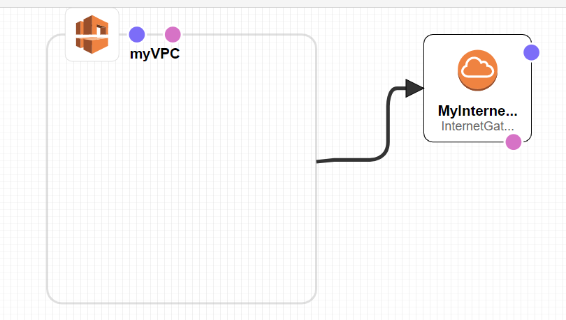
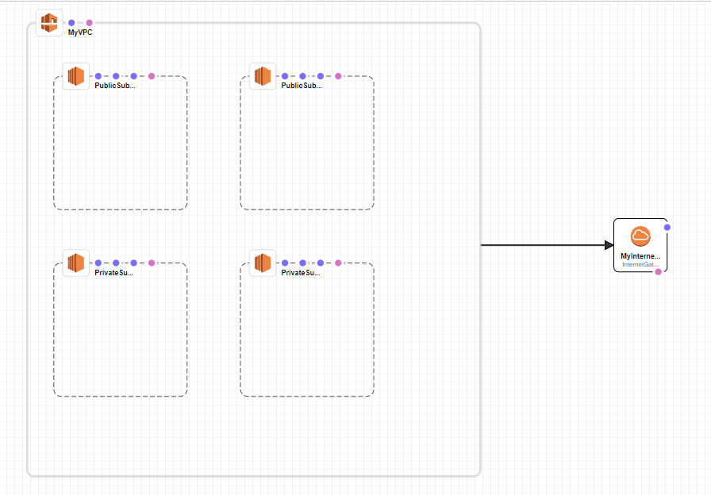
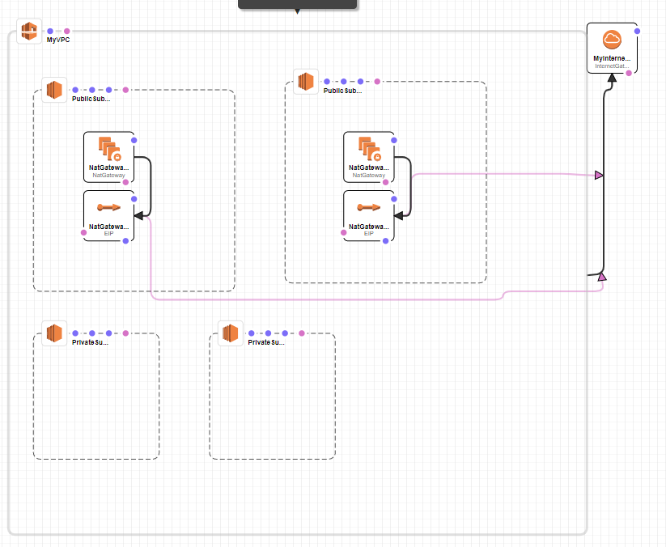
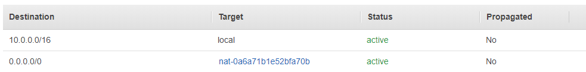
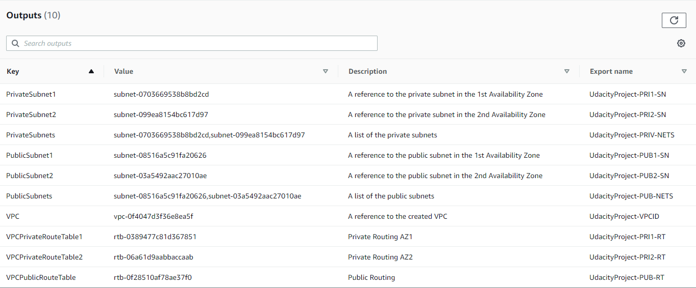
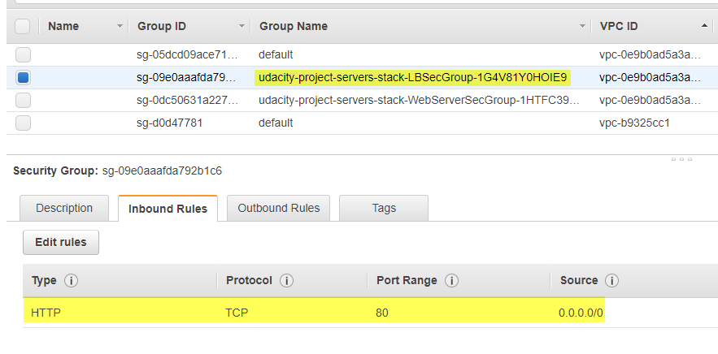
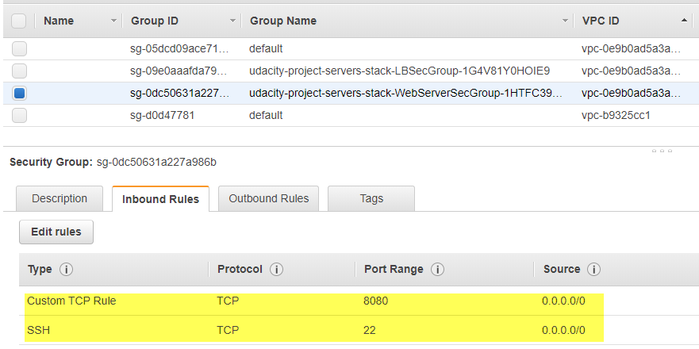
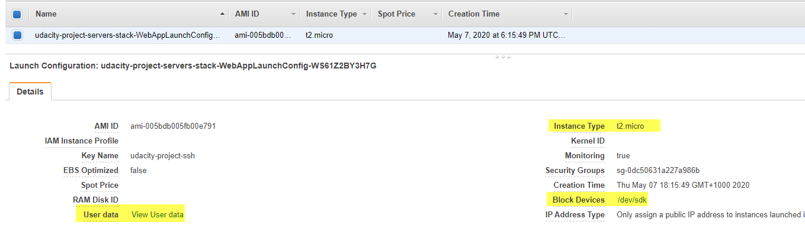

#### Lesson 1: Getting Started with Cloud Formation

#### 3. What is DevOps

DevOps is the combination of industry best practices, and set of tools that improve an organization’s ability to:

- Increase the speed of software delivery
- Increases the speed of software evolution
- Have better reliability of the software
- Have scalability using automation,
- Improved collaboration among teams.

In other words, these tools enable a company to showcase industry best practices in software development.

#### 4. Why you need DevOps

Issues that DevOps tries to solve:

- Unpredictable deployments
- Mismatched environments (development doesn’t match production)
- Configuration Drift

#### 5. What are the benefits of Cloud DevOps?

DevOps best practices and tools
One of the benefits of using DevOps is that it allows predictable deployments using automated scripts. In the DevOps model, development and operations teams are merged into a single team. These DevOps teams use a few tools and best practices that deploy and manage configuration changes to servers.

The most important practices are:

- Continuous Integration / Continuous Delivery (CI/CD) - new features are automatically deployed with all the required dependencies.
- Infrastructure as Code (IaaC) - configuration and management of cloud infrastructure using re-usable scripts.

Other prevalent practices are:

- Microservices
- Monitoring and Logging
- Communication and Collaboration

Glossary

1. **Continuous Integration Continuous Deployment (CI/CD)**: Tracks the development workflow from testing through production. Continuous integration is the process flow of testing any change made to your development flow, while continuous deployment tracks those changes through to staging and production systems. You may like to read this article by Atlassian.com that describes CI/CD in detail.

2. **Infrastructure as code (IaaC)**: Provision and manages the cloud-infrastructure by using scripts. These scripts can be written in YAML or JSON format. These scripts ensure that the same architecture can be re-built multiple numbers of times. These scripts are particularly useful in enterprise applications and different environments - dev, prod, or test. Read more here.

3. **CloudFormation**: CloudFormation is a tool in AWS for managing, configuring and deploying infrastructure (push code along with the necessary server configurations).

#### 7. Creating Access Key ID for IAM User

When creating IAM user, you don't need to specify region, as IAM Users are global.

Deciding Access Privileges within AWS

##### Programmatic Access

In the AWS console, choose "programmatic access." This allows us to use code to interact with AWS, instead of relying on mouse clicking in the console web pages.

##### dministrator Access

For IAM access, choose “administrator access.” This is just for initial setup of your account. Afterwards, you’ll want to limit access to only what you need.

##### Dev and Prod user accounts

In practice, Dev and DevOps members may have separate user accounts for the dev environment as opposed to the production environment. This makes it easier for developers by giving them wider privileges in the dev environment that would normally only be reserved for DevOps members in the production environment.

##### Access Key ID and Secret Access Keys

Remember not to save these in your code or to check into any repositories. Keep these private to you.

#### Configuring AWS CLI

- Be sure to rotate your keys every 90 days
- Disable or delete unused ones and save them in a good location, such as AWS’s own Parameter Store.

#### 9. Adding Additional Keys

Additional Access Keys
Note that each user can have up to 2 access keys at the same time.

Why Making Keys Inactive is a Better Choice
You may make your access key temporarily inactive rather than destroying it and creating a new one. This may be helpful if you want to stop an automated process that uses that key (for example, a CI/CD process).

#### 10. Understanding CloudFormation

CloudFormation

- CloudFormation is a declarative language, not an imperative language.
- CloudFormation handles resource dependencies so that you don’t have to specify which resource to start up before another. There are cases where you can specify that a resource depends on another resource, but ideally, you’ll let CloudFormation take care of dependencies.
- VPC is the smallest unit of resource.

Glossary
**Declarative languages**: These languages specify what you want, without requiring you to specify how to get it. An example of a popular declarative language is SQL.
**Imperative languages**: These languages use statements to change the state of the program.
Additional resources:

#### 11. Getting Started With CloudFormation Script

Having scripts specific for networking and other scripts specific to EC2 Servers or Databases keep your scripts small, and easily shared across teams with different skill sets, such as database administrators and network experts.

YAML and JSON

- YAML and JSON file formats are both supported in CloudFormation, but YAML is the industry preferred version that’s used for AWS and other cloud providers (Azure, Google Cloud Platform).

- An important note about YAML files: the whitespace indentation matters! We recommend that you use four white spaces for each indentation.

Glossary in CloudFormation scripts
**Name**: A name you want to give to the resource (does this have to be unique across all resource types?)

**Type**: Specifies the actual hardware resource that you’re deploying.

**Properties**: Specifies configuration options for your resource. Think of these as all the drop-down menus and checkbox options that you would see in the AWS console if you were to request the resource manually.

**Stack**: A stack is a group of resources. These are the resources that you want to deploy, and that are specified in the YAML file.

Best practices
**Coding best practice**: Create separate files to organize your code. You can either create separate files for similar resources or create files for each developer who uses those resources.

#### 12. Testing CloudFormation

Our first cloudformation template:

```yaml
Description: >
  Author .. / Udacity
  This template deploys a VPC.
Resources:
  UdacityVPC: # arbitrary name for a resource
    Type: AWS::EC2::VPC
    Properties:
      CidrBlock: 10.0.0.0/16
      EnableDnsHostnames: true
```

For creating stack:

```
aws cloudFormation create-stack --stack-name myFirstStack --template-body file://testcfn.yml
```

For updating stack:

```
aws cloudFormation update-stack --stack-name myFirstStack --template-body file://testcfn.yml
```

For deleting stack:

```
aws cloudFormation delete-stack --stack-name myFirstStack
```

also can be in bash script

```bash
#!/bin/bash

aws cloudformation delete-stack --stack-name $1
```

run

```
./test_delete_stack.sh myFirstStack
```

#### Lesson 2: Infrastructure Diagrams

Diagrams are a very important starting point for planning your cloud infrastructure. DevOps engineers start with a visual representation of the required cloud infrastructure before they turn it into code. This lesson will show you how to interpret these infrastructure diagrams.

#### 2. Generalizing to other cloud providers

https://www.lucidchart.com/
cloudcraft.co

#### 7. Diagramming Availability Zones

Glossary
Availability Zones (AZ): An AZ is a set of one or more data centers (physical building).

Best Practices

- Choose to have more than one availability zone to avoid a single point of failure.
- Include more than one availability zone to design for high availability, .
- You may choose to reduce to one AZ, possibly for prototyping and design for low cost. But it is not recommended for production environments.

#### 9. Virtual Private Cloud

The main attribute of your VPC is the block of IP addresses, or CIDR block.

VPCs provide you with private IP address for your networking resources

A VPC can span over several **multiple Availability Zones**.

Purpose of Having Subnets:

- Create Logical Separation between resources. (Say separate Dev/UAT/Prod)
- Block or Allow access to/from groups of resources
- Provides services to a specific set of resources and not to others

Create subnets and VPCs with future expansion in mind!

Glossary
Virtual Private Cloud (VPC): A virtual private cloud is a pool of networked cloud resources. It can span more than one availability zone.
The equivalent of this would be a data center. However, thanks to availability zones, VPCs can span more than one physical building. This is an amazing feature that protects against real world disasters like electrical failures, fires and similar events.

#### 11. Public vs Private Subnets

Subnets

- A subnet is a subset of the overall VPC network and it only exists in a single availability zone, unlike its parent network, the VPC.
- A subnet contains resources, and can be assigned access rights that apply to all resources within that subnet.
- Subnets can be public or private. Public subnets are accessible to external users. Private subnets are only accessed internally by other resources within your cloud container.

Use IP addresses for routing traffic

- Use IP addresses as the “keys” for routing traffic. We can route traffic to stay within the VPC, or within a particular subnet, for security reasons.
- For example, **a database, a back-end application server or any sensitive data will be placed in a private subnet**. A public server, like a web server, or a load balancer to your web servers, can be placed in a public subnet. - Routing rules applied to a subnet allow us to define access to all resources placed inside that subnet.

#### 13. IGW Internet Gateway

To provide internet access to a VPC:

- Create an IGW
- Attach the IGW to your VPC
- Create a route to the IGW and associated it with your subnets(s)

Software Defined Networking
VPCs and subnets with VPCs called Software Defined Networking. That is, using APIs and already-existing physical infrastructure to create our own networking layer on top, with our own privacy rules, our own routing and our own Private IP Space.

VPN or Virtual Private Network
It is a type of encrypted connectivity that You can setup between your on-premise data center and your Virtual Private Cloud. This allows access in and out of your AWS VPC in a secure manner, across the internet and using internal, Private IP addresses.

DirectConnect
It is a DirectConnect is a physical data line that you can purchase directly from AWS or through a telecommunication service provider to access your AWS Cloud without moving your data traffic across the public internet.

Internet Gateway

- An internet gateway is a resource that enables inbound and outbound traffic from the internet to your VPC.
- An internet gateway allows external users access to communicate with parts of your VPC.
- If you create a private VPC for an application that is internal to your company, you will not need an internet gateway attached at the edge of your VPC.

#### 15. Network Address Translation (NAT) Gateway

It provides **outbound-only** internet gateway for private services to access the internet. This keeps the private service protected from inbound connections, but allows it to connect to the internet in order to perform functions such as downloading software updates. The NAT gateway serves as an intermediary to take a private resource’s request, connect to the internet, and then relay the response back to the private resource without exposing that private resource’s IP address to the public.

**Note**: Place NAT Gateways inside the **public subnets and not the private subnets**. NAT gateways need to be in the public subnet so that they can communicate with the public internet, and handle requests from resources that are in a private subnet.

#### 17. Autoscaling groups

Glossary
Autoscaling group: It is a coherent group of Virtual Machines (EC2 instances) that allows running the exact number of VMs that are required to meet the demand/specification. The autoscaling group can automatically start or stop the servers (EC2 instances) according to the amount of incoming traffic. This behavior of the autoscaling group helps in two ways:

- The consumer pays for the only duration of the servers when they were active.
- The consumer doesn't have to worry about horizontal scaling of servers for a sudden peak in incoming traffic.

Autoscaling group:

- Needs more than one subnet to ensure availability

You can take advantage of the safety and reliability of geographic redundancy by spanning your Auto Scaling group across multiple Availability Zones within a Region and then attaching a load balancer to distribute incoming traffic across those zones. Incoming traffic is distributed equally across all Availability Zones enabled for your load balancer.

**When one Availability Zone becomes unhealthy or unavailable, Amazon EC2 Auto Scaling launches new instances in an unaffected zone**. When the unhealthy Availability Zone returns to a healthy state, Amazon EC2 Auto Scaling automatically redistributes the application instances evenly across all of the zones for your Auto Scaling group. Amazon EC2 Auto Scaling does this by attempting to launch new instances in the Availability Zone with the fewest instances. If the attempt fails, however, Amazon EC2 Auto Scaling attempts to launch in other Availability Zones until it succeeds.

You can expand the availability of your scaled and load-balanced application by adding an Availability Zone to your Auto Scaling group and then enabling that zone for your load balancer. After you've enabled the new Availability Zone, the load balancer begins to route traffic equally among all the enabled zones.

- It can be used for both High Availability and Elasticity. Elasticity is the ability to expand and contract your resources to meed changing demand

Best Practice

- It is recommended that an autoscaling group **spans more than one availability zone, for reliability**.
- If we set the autoscaling group to run one resource, it will run that one resource in one of the availability zones.
- If there is a failure of that resource, the autoscaling group will shut it down in that availability zone and start that same resource in the other availability zone.

#### 19. Load Balancers

Load Balancer

- A load balancer takes incoming traffic and distributes it to two or more resources. For example, it can take inbound user requests to access your website, and it can distribute the requests evenly among two or more servers.
- Another benefit of have load balancer is **health check**.
- **Without** a load balancer, having public-facing servers in more than one AZ would mean that users would have to use a different URL to reach each of the AZs. This can be impractical compared to just a single URL.

Good practice

- Assume we have a set of web-servers in private subnet(s). Then, we must have a Load Balancer that would access our web-servers. These web-servers, in turn, would access the backend database.

#### 21. Security Groups

Security Groups

- Security groups manage traffic at the server level (the resource level). Security Groups aren’t for managing higher-level groups such as subnets, VPC, or user accounts.
- The same security group can be assigned to multiple resources that require the same security access settings defined by that security group.

#### 23. Routing Table

By Routing Table, you can regular to/from of your network.

Routing Table:

- A set of entries or rules associated with one or more of your subnets inside your VPC.
- These rules allow or deny traffic to/from the address ranges that you specify.
- Rules can be as open as the entire world, or restricted to a single IP address.


In above example:

1. Public subnet is using Custom route table. Private subnet is using Main route table.
2. The first entries from both table, means all traffic to 10.0.0.0/16 are local traffic, so private subnet 10.0.1.0/24 and public subnet 10.0.0.0/24 can see each other.
3. For public subnet, other traffic will be directed to igw-id, which is the Internet Gateway sitting at the edge of VPC. So it has public internet access.
4. For private subnet, other traffic will be directed to vgw-id, which is the Virtual Private Gateway at the edge of the VPN connection, which only can visit Corporate Network in the diagram.

#### 25. S3

- An S3 bucket is a public service for users to upload or download files, you cannot put it inside of your VPC.
- Place the S3 service outside of your VPC.

#### 26. Reviewing Our Diagram

From the diagram, the load balancer looks like a single point of entry, possibly single point of failure, it actually will be spears across 2 of your your AZs. (When you create load balancer you need to specify at least 2 AZs.) The same applies for the Internet Gateway and the Routing and the Auto Scaling. Those things you can assume safely that they are not going to fail, because they have multiple copies of those services running behind the scenes for you.

Do not include hostnames and IP Addresses in your cloud diagram. it would be too much clutter and the data can change.

#### 28. Conclusion

Review the AWS Reference Architecture Page
Visit the [AWS Reference Architecture Page](https://aws.amazon.com/architecture/) and study some of the diagrams.

A good example here:

[Hosting WordPress on AWS](https://github.com/aws-samples/aws-refarch-wordpress) is a great example to help you understand how auto-scaling servers keep track of non-database data, such as images, config files, and similar objects, in this particular case by means of external storage (EFS) mounted to the EC2 Servers -- much like the way you would have your personal files and photos in an external USB drive that you can connect to any computer when you need to access them.

#### Lesson 3: Networking Infrastructure

#### Introduction

Project Diagram


**Step 01: Creating a VPC**

```yaml
Parameters:
  EnvironmentName:
    Description: An environment name that will be prefixed to resources
    Type: String

  VpcCIDR:
    Description: Please enter the IP range (CIDR notation) for this VPC.
    Type: String
    Default: 10.0.0.0/16

Resources:
  myVPC:
    Type: AWS::EC2::VPC
    Properties:
      CidrBlock: !Ref VpcCIDR
      EnableDnsSupport: true
      Tags:
        - Key: Name
          Value: !Ref EnvironmentName
```

You can verify it in CloudFormation and see if there is any error:


Add a Named Profile in your aws config

```
aws configure --profile udacity

AWS Access Key ID [None]: AKIA3RB******5EG5F
AWS Secret Access Key [None]: **********************
Default region name [None]: us-west-2
Default output format [None]:
```

Then if you check your `./aws/config`

```
[profile udacity]
region = us-west-2

```

and `./aws/credentials`, you will see something like:

```
[udacity]
aws_access_key_id = AKIA3RB******5EG5F
aws_secret_access_key = **********************
```

And our `create-stack.sh` will be using this profile

```sh
aws cloudformation create-stack \
--profile udacity \
--stack-name $1 \
--template-body file://$2 \
--parameters file://$3 \
--region=us-west-2
```

**Step 02: Adding an Internet Gateway (IGW) to VPC**
We need 2 resources, an Internet Gateway, and an Internet Gateway Attachment, which will attach the Internet Gateway to a VPC

```yaml
Parameters:
  EnvironmentName:
    Description: An environment name that will be prefixed to resources
    Type: String

  VpcCIDR:
    Description: Please enter the IP range (CIDR notation) for this VPC.
    Type: String
    Default: 10.0.0.0/16

Resources:
  MyVPC:
    Description: Main VPC to host my subnets
    Type: AWS::EC2::VPC
    Properties:
      CidrBlock: !Ref VpcCIDR
      EnableDnsSupport: true
      Tags:
        - Key: Name
          Value: !Ref EnvironmentName

  MyInternetGateway:
    Description: To Provide Internet Access
    Type: AWS::EC2::InternetGateway
    Properties:
      Tags:
        - Key: Name
          Value: !Ref EnvironmentName
  MyInternetGatewayAttachment:
    Description: To attach MyInternetGateway to MyVPC
    Type: AWS::EC2::VPCGatewayAttachment
    Properties:
      VpcId: !Ref MyVPC
      InternetGatewayId: !Ref MyInternetGateway
```

If we copy the yaml file into CloudFormation Designer


#### 4. NAT Gateway And Subnets

Now we have a VPC with Internet access. But there is no subnets in it yet.

**Step 03: Adding Subnets to existing VPC**

```yaml
# more code omitted
PublicSubnet1CIDR:
  Description: Please enter the IP range (CIDR notation) for the public subnet in the first Availability Zone
  Type: String
  Default: 10.0.0.0/24

PublicSubnet2CIDR:
  Description: Please enter the IP range (CIDR notation) for the public subnet in the second Availability Zone
  Type: String
  Default: 10.0.1.0/24

PrivateSubnet1CIDR:
  Description: Please enter the IP range (CIDR notation) for the private subnet in the first Availability Zone
  Type: String
  Default: 10.0.2.0/24

PrivateSubnet2CIDR:
  Description: Please enter the IP range (CIDR notation) for the private subnet in the second Availability Zone
  Type: String
  Default: 10.0.3.0/24

PublicSubnet1:
  Description: Public subnet hosted in Availability Zone 1
  Type: AWS::EC2::Subnet
  Properties:
    VpcId: !Ref MyVPC # which VPC this subnet belongs to
    AvailabilityZone: !Select [0, !GetAZs ""] # Select a value from the List, Returned by Fn::GetAZs function
    CidrBlock: !Ref PublicSubnet1CIDR
    MapPublicIpOnLaunch: true
    Tags:
      - Key: Name
        Value: !Sub ${EnvironmentName} Public Subnet (AZ1)

PublicSubnet2:
  Description: Public subnet hosted in Availability Zone 2
  Type: AWS::EC2::Subnet
  Properties:
    VpcId: !Ref MyVPC # which VPC this subnet belongs to
    AvailabilityZone: !Select [1, !GetAZs ""] # Select a value from the List, Returned by Fn::GetAZs function
    CidrBlock: !Ref PublicSubnet2CIDR
    MapPublicIpOnLaunch: true
    Tags:
      - Key: Name
        Value: !Sub ${EnvironmentName} Public Subnet (AZ2)

PrivateSubnet1:
  Description: Private subnet hosted in Availability Zone 1
  Type: AWS::EC2::Subnet
  Properties:
    VpcId: !Ref MyVPC # which VPC this subnet belongs to
    AvailabilityZone: !Select [0, !GetAZs ""] # Select a value from the List, Returned by Fn::GetAZs function
    CidrBlock: !Ref PrivateSubnet1CIDR
    MapPublicIpOnLaunch: false
    Tags:
      - Key: Name
        Value: !Sub ${EnvironmentName} Private Subnet (AZ1)

PrivateSubnet2:
  Description: Private subnet hosted in Availability Zone 2
  Type: AWS::EC2::Subnet
  Properties:
    VpcId: !Ref MyVPC # which VPC this subnet belongs to
    AvailabilityZone: !Select [1, !GetAZs ""] # Select a value from the List, Returned by Fn::GetAZs function
    CidrBlock: !Ref PrivateSubnet2CIDR
    MapPublicIpOnLaunch: false
    Tags:
      - Key: Name
        Value: !Sub ${EnvironmentName} Private Subnet (AZ2)
# more code omitted
```

1. Syntax for AWS::EC2::Subnet

[AWS::EC2::Subnet User Guide](https://docs.aws.amazon.com/AWSCloudFormation/latest/UserGuide/aws-resource-ec2-subnet.html)

```yaml
Type: AWS::EC2::Subnet
Properties:
  AssignIpv6AddressOnCreation: Boolean
  AvailabilityZone: String # The Availability Zone of the subnet.
  CidrBlock: String # The IPv4 CIDR block assigned to the subnet.
  Ipv6CidrBlock: String
  MapPublicIpOnLaunch: Boolean # Indicates whether instances launched in this subnet receive a public IPv4 address.
  Tags:
    - Tag
  VpcId: String # Required!! The ID of the VPC the subnet is in.
```

2. Fn::Select, Fn::GetAZs and Fn::Sub functions

##### Fn::Select

The intrinsic function `Fn::Select` returns a single object from a list of objects by index.
Syntax

```
Fn::Select: [ index, listOfObjects ]

or

!Select [ index, listOfObjects ]
```

##### Fn::GetAZs

The intrinsic function `Fn::GetAZs` returns an array that lists Availability Zones for a specified region.

Syntax

```
Fn::GetAZs: region

or

!GetAZs region
```

##### Fn::Sub

[Fn::Sub](https://docs.aws.amazon.com/AWSCloudFormation/latest/UserGuide/intrinsic-function-reference-sub.html)

The intrinsic function `Fn::Sub` substitutes variables in an input string with values that you specify.
In your templates, you can use this function to construct commands or outputs that include values that aren't available until you create or update a stack.

Syntax

```
Fn::Sub:
  - String
  - Var1Name: Var1Value
    Var2Name: Var2Value

or

!Sub
  - String
  - Var1Name: Var1Value
    Var2Name: Var2Value
```

Examples:
Fn::Sub with a Mapping
The following example uses a mapping to substitute the \${Domain} variable with the resulting value from the Ref function.

```yaml
Name: !Sub
  - www.${Domain}
  - { Domain: !Ref RootDomainName }
```

Fn::Sub without a Mapping
The following example uses Fn::Sub with the AWS::Region and AWS::AccountId pseudo parameters and the vpc resource logical ID to create an Amazon Resource Name (ARN) for a VPC.

```yaml
!Sub "arn:aws:ec2:${AWS::Region}:${AWS::AccountId}:vpc/${vpc}"
```

In our template:

`AvailabilityZone: !Select [1, !GetAZs ""]` Fn::Select function will get the element from a given list with a specified index. Fn::GetAZs will return the list of the Availability Zones resides in your Region. For example your Region is us-west-2, then the AZs list will have 4 values, and we just use the first and second value, which are us-west-2a, us-west-2b

`!Sub ${EnvironmentName} Private Subnet (AZ2)` replace the \${EnvironmentName} with value of EnvironmentName Parameter. In our example, the replaced value will be `UdacityProject Public Subnet (AZ2)`

If we copy the yaml file into CloudFormation Designer


**Step 04: Add NAT**

##### AWS::EC2::EIP

[AWS::EC2::EIP](https://docs.aws.amazon.com/AWSCloudFormation/latest/UserGuide/aws-properties-ec2-eip.html)

Syntax

```yaml
Type: AWS::EC2::EIP
Properties:
  Domain: String # Set to vpc to allocate the address for use with instances in a VPC.
  InstanceId: String # The ID of the instance.
  PublicIpv4Pool: String # The ID of an address pool that you own. Use this parameter to let Amazon EC2 select an address from the address pool.
  Tags:
    - Tag
```

Return Values
**Ref**
When you pass the logical ID of this resource to the intrinsic Ref function, Ref returns the Elastic IP address.

For more information about using the Ref function, see Ref.

**Fn::GetAtt**
The `Fn::GetAtt` intrinsic function returns a value for a specified attribute of this type. The following are the available attributes and sample return values.

For more information about using the Fn::GetAtt intrinsic function, see Fn::GetAtt.

`AllocationId`
The ID that AWS assigns to represent the allocation of the address for use with Amazon VPC. This is returned only for VPC elastic IP addresses. For example, eipalloc-5723d13e.

##### AWS::EC2::NatGateway

[AWS::EC2::NatGateway](https://docs.aws.amazon.com/AWSCloudFormation/latest/UserGuide/aws-resource-ec2-natgateway.html)

Specifies a network address translation (NAT) gateway in the specified public subnet.

Syntax

```yaml
Type: AWS::EC2::NatGateway
Properties:
  AllocationId: String # The allocation ID of an Elastic IP address to associate with the NAT gateway. If the Elastic IP address is associated with another resource, you must first disassociate it.
  SubnetId: String # The public subnet in which to create the NAT gateway.
  Tags:
    - Tag
```

Return Values
**Ref**
When you pass the logical ID of this resource to the intrinsic Ref function, Ref returns the resource name. For example, nat-0a12bc456789de0fg.

```yaml
# more code omitted

MyInternetGatewayAttachment:
  Description: To attach MyInternetGateway to MyVPC
  Type: AWS::EC2::VPCGatewayAttachment
  Properties:
    VpcId: !Ref MyVPC
    InternetGatewayId: !Ref MyInternetGateway

# more code omitted

NatGateway1EIP:
  Description: Elastic IP attach to a VPC
  Type: AWS::EC2::EIP
  DependsOn: MyInternetGatewayAttachment
  Properties:
    Domain: MyVPC
NatGateway2EIP:
  Description: Elastic IP attach to a VPC
  Type: AWS::EC2::EIP
  DependsOn: MyInternetGatewayAttachment
  Properties:
    Domain: MyVPC

NatGateway1:
  Description: Nat Gateway for Public Subnet 1
  Type: AWS::EC2::NatGateway
  Properties:
    AllocationId: !GetAtt NatGateway1EIP.AllocationId # The allocation ID of an Elastic IP address to associate with the NAT gateway
    SubnetId: !Ref PublicSubnet1 # Logical Id of the attaching subnet
NatGateway2:
  Description: Nat Gateway for Public Subnet 2
  Type: AWS::EC2::NatGateway
  Properties:
    AllocationId: !GetAtt NatGateway2EIP.AllocationId # The allocation ID of an Elastic IP address to associate with the NAT gateway
    SubnetId: !Ref PublicSubnet2 # Logical Id of the attaching subnet

# more code omitted
```

Here we create 2 Elastic IP address, they will NOT be created before `MyInternetGatewayAttachment` is complete, as they are `DependsOn` on `MyInternetGatewayAttachment`. This means once `MyInternetGatewayAttachment` is done, and then create 2 EIP

If we copy the yaml file into CloudFormation Designer


From above image, you can see the 4 subnets are not connected yet. We need routing between these subnets.

#### 5. Routing

##### AWS::EC2::RouteTable

[AWS::EC2::RouteTable](https://docs.aws.amazon.com/AWSCloudFormation/latest/UserGuide/aws-resource-ec2-route-table.html)

Specifies a route table for a specified VPC. After you create a route table, you can add routes and associate the table with a subnet.

Syntax

```yaml
Type: AWS::EC2::RouteTable
Properties:
  Tags:
    - Tag
  VpcId: String # required. The ID of the VPC.
```

Return Values
**Ref**
When you pass the logical ID of this resource to the intrinsic Ref function, Ref returns the ID of the route table.

##### AWS::EC2::Route

[AWS::EC2::Route](https://docs.aws.amazon.com/AWSCloudFormation/latest/UserGuide/aws-resource-ec2-route.html)

Specifies a route in a route table within a VPC.

Syntax

```yaml
Type: AWS::EC2::Route
Properties:
  DestinationCidrBlock: String # The IPv4 CIDR block used for the destination match.
  DestinationIpv6CidrBlock: String
  EgressOnlyInternetGatewayId: String
  GatewayId: String # The ID of an internet gateway or virtual private gateway attached to your VPC.
  InstanceId: String # The ID of a NAT instance in your VPC.
  NatGatewayId: String # The ID of a NAT gateway.
  NetworkInterfaceId: String # The ID of the network interface.
  RouteTableId: String # Required. The ID of the route table. The routing table must be associated with the same VPC that the virtual private gateway is attached to.
  TransitGatewayId: String
  VpcPeeringConnectionId: String
```

Return Values
**Ref**
When you pass the logical ID of this resource to the intrinsic Ref function, Ref returns the ID of the route.

##### AWS::EC2::SubnetRouteTableAssociation

[AWS::EC2::SubnetRouteTableAssociation](https://docs.aws.amazon.com/AWSCloudFormation/latest/UserGuide/aws-resource-ec2-subnet-route-table-assoc.html)

Associates a subnet with a route table. The subnet and route table must be in the same VPC.

Syntax

```yaml
Type: AWS::EC2::SubnetRouteTableAssociation
Properties:
  RouteTableId: String # Required. The ID of the route table.
  SubnetId: String # Required. The ID of the subnet.
```

Return Values
**Ref**
When you pass the logical ID of this resource to the intrinsic Ref function, Ref returns the ID of the subnet route table association.

**Step 05: Create route table, add route, and associate it with a subnet.**

For public routing, we created a routing table, then added a default/catch all route, the DestinationCidrBlock property is used for destination matching and a `wildcard address` `(0.0.0/0)` to reference all traffic. So in the following example, when we use the wildcard address `0.0.0.0/0`, we are saying for any address that comes through this route, send it to the referenced `GatewayId`.

The `local` route which is inside the VPC `10.0.0.0/16` will take precedence. This is because routes go from very specific to the least as specific, therefore, `10.0.0.0/16` route is more specific, and hence will take precedence.

Also we need to create a subnet association between this route table, and a subnet.



```yaml
# more code omitted

PublicRouteTable:
  Type: AWS::EC2::RouteTable
  Properties:
    VpcId: !Ref MyVPC
    Tags:
      - Key: Name
        Value: !Sub ${EnvironmentName} Public Routes

DefaultPublicRoute:
  Type: AWS::EC2::Route
  DependsOn: MyInternetGatewayAttachment
  Properties:
    RouteTableId: !Ref PublicRouteTable
    DestinationCidrBlock: 0.0.0.0/0
    GatewayId: !Ref MyInternetGateway

PublicRouteTableAssociation1:
  Type: AWS::EC2::SubnetRouteTableAssociation
  Properties:
    RouteTableId: !Ref PublicRouteTable
    SubnetId: !Ref PublicSubnet1
# more code omitted
```

And for Private Route Tables:

```yaml
# more code omitted

PrivateRouteTable1:
  Type: AWS::EC2::RouteTable
  Properties:
    VpcId: !Ref MyVPC
    Tags:
      - Key: Name
        Value: !Sub ${EnvironmentName} Private Routes (AZ1)

DefaultPrivateRoute1:
  Type: AWS::EC2::Route
  Properties:
    RouteTableId: !Ref PrivateRouteTable1
    DestinationCidrBlock: 0.0.0.0/0
    NatGatewayId: !Ref NatGateway1

PrivateRouteTable1Association:
  Type: AWS::EC2::SubnetRouteTableAssociation
  Properties:
    RouteTableId: !Ref PrivateRouteTable1
    SubnetId: !Ref PrivateSubnet1

PrivateRouteTable2:
  Type: AWS::EC2::RouteTable
  Properties:
    VpcId: !Ref MyVPC
    Tags:
      - Key: Name
        Value: !Sub ${EnvironmentName} Private Routes (AZ2)

DefaultPrivateRoute2:
  Type: AWS::EC2::Route
  Properties:
    RouteTableId: !Ref PrivateRouteTable2
    DestinationCidrBlock: 0.0.0.0/0
    NatGatewayId: !Ref NatGateway2

PrivateRouteTable2Association:
  Type: AWS::EC2::SubnetRouteTableAssociation
  Properties:
    RouteTableId: !Ref PrivateRouteTable2
    SubnetId: !Ref PrivateSubnet2
# more code omitted
```

Note is private route table, similarly we create a route table, add some routes and associate it with a subnet. However a big difference between a public route table and private route table is, in private route table, we setup `ALL` route to point to a NAT Gateway `NatGatewayId: !Ref NatGateway2`. while in in public route table, we setup `ALL` route to point to a Internet Gateway `GatewayId: !Ref MyInternetGateway`.

Glossary
Routing: Routing is the action of applying routing rules to your network, in this case, to your VPC.
Routing rule: Resources follow the routing rule, which defines what resource has access to communicate with another resource. It blocks traffic from resources that do not follow the routing rule.

#### 6. Outputs

Outputs are optional but are very useful if there are output values you need to:

- import into another stack
- return in a response
- view in AWS console

Syntax

```yaml
Outputs:
  Logical ID:
    Description: Information about the value
    Value: Value to return
    Export:
      Name: Value to export
```

Join Function
You can use the join function to combine a group of values. The syntax requires you provide a delimiter and a list of values you want appended.

Join function syntax:

```
Fn::Join: [ delimiter, [ comma-delimited list of values ] ]
```

In the following example we are using !Join to combine our subnets before returning their values:

```yaml
PublicSubnets:
  Description: A list of the public subnets
  Value: !Join [",", [!Ref PublicSubnet1, !Ref PublicSubnet2]]
  Export:
    Name: !Sub ${EnvironmentName}-PUB-NETS
```

**Step 06: Expose the resources we have created so far via `Outputs`**

```yaml
# more code omitted

Outputs:
  VPC:
    Description: A reference to the created VPC
    Value: !Ref MyVPC
    Export:
      Name: !Sub ${EnvironmentName}-VPCID

  VPCPublicRouteTable:
    Description: Public Routing
    Value: !Ref PublicRouteTable
    Export:
      Name: !Sub ${EnvironmentName}-PUB-RT

  VPCPrivateRouteTable1:
    Description: Private Routing AZ1
    Value: !Ref PrivateRouteTable1
    Export:
      Name: !Sub ${EnvironmentName}-PRI1-RT

  VPCPrivateRouteTable2:
    Description: Private Routing AZ2
    Value: !Ref PrivateRouteTable2
    Export:
      Name: !Sub ${EnvironmentName}-PRI2-RT

  PublicSubnets:
    Description: A list of the public subnets
    Value: !Join [",", [!Ref PublicSubnet1, !Ref PublicSubnet2]]
    Export:
      Name: !Sub ${EnvironmentName}-PUB-NETS

  PrivateSubnets:
    Description: A list of the private subnets
    Value: !Join [",", [!Ref PrivateSubnet1, !Ref PrivateSubnet2]]
    Export:
      Name: !Sub ${EnvironmentName}-PRIV-NETS

  PublicSubnet1:
    Description: A reference to the public subnet in the 1st Availability Zone
    Value: !Ref PublicSubnet1
    Export:
      Name: !Sub ${EnvironmentName}-PUB1-SN

  PublicSubnet2:
    Description: A reference to the public subnet in the 2nd Availability Zone
    Value: !Ref PublicSubnet2
    Export:
      Name: !Sub ${EnvironmentName}-PUB2-SN

  PrivateSubnet1:
    Description: A reference to the private subnet in the 1st Availability Zone
    Value: !Ref PrivateSubnet1
    Export:
      Name: !Sub ${EnvironmentName}-PRI1-SN

  PrivateSubnet2:
    Description: A reference to the private subnet in the 2nd Availability Zone
    Value: !Ref PrivateSubnet2
    Export:
      Name: !Sub ${EnvironmentName}-PRI2-SN
# more code omitted
```

And all outputs and their value:


#### Summary

As this lesson comes to an end, now you should be able to ...

- Describe the syntax of the CloudFormation code that builds the infrastructure
- Build the following resources -
  - Virtual Private Cloud and subnets
  - Internet gateway and NAT gateway
  - Route table
- Export the stack output

#### Lesson 4: Servers and Security Groups

#### 3. Understanding Security Groups

##### AWS::EC2::SecurityGroup

Security Groups

- Security groups are specific to individual resources (EC2 servers, databases) and not to subnets.

Traffic is blocked by default

- In cloud, traffic is completely blocked, so you have to explicitly open ports to allow traffic in and out. This is a general networking concept.

Limit inbound traffic for security

- For ingress rules, we want to limit inbound traffic, for security, to a single port or just a handful of ports required by the application we are running.
- If it’s a public web server, for example, it will require `port 80` open to the world (World = `0.0.0.0/0`)
- Should you need the SSH port open, restrict this port only to your specific IP address.

For outbound traffic, give full access
For egress rules, we want to give the resource full access to the internet, so we give egress access to all ports, from `0` all the way to `65535`.

[AWS::EC2::SecurityGroup](https://docs.aws.amazon.com/AWSCloudFormation/latest/UserGuide/aws-properties-ec2-security-group.html)

Specifies a security group. To create a security group, use the VpcId property to specify the VPC for which to create the security group.

Syntax

```yaml
Type: AWS::EC2::SecurityGroup
Properties:
  GroupDescription: String # A description for the security group. This is informational only.
  GroupName: String # The name of the security group.
  SecurityGroupEgress: # [VPC only] The outbound rules associated with the security group.
    - Egress
  SecurityGroupIngress: # The inbound rules associated with the security group.
    - Ingress
  Tags:
    - Tag
  VpcId: String # [VPC only] The ID of the VPC for the security group.
```

Return Values
**Ref**
When you pass the logical ID of this resource to the intrinsic Ref function, Ref returns the resource ID. For security groups that were created without specifying a VPC (EC2-Classic or a default VPC), Ref returns the resource name.

**Fn::GetAtt**
The `Fn::GetAtt` intrinsic function returns a value for a specified attribute of this type. The following are the available attributes and sample return values.

For more information about using the Fn::GetAtt intrinsic function, see Fn::GetAtt.

GroupId
The group ID of the specified security group, such as sg-94b3a1f6.

VpcId
The physical ID of the VPC. You can obtain the physical ID by using a reference to an AWS::EC2::VPC, such as: { "Ref" : "myVPC" }.

Examples

```yaml
InstanceSecurityGroup:
  Type: AWS::EC2::SecurityGroup
  Properties:
    GroupDescription: Allow http to client host
    VpcId:
      Ref: myVPC
    SecurityGroupIngress:
      - IpProtocol: tcp
        FromPort: 80
        ToPort: 80
        CidrIp: 0.0.0.0/0
    SecurityGroupEgress:
      - IpProtocol: tcp
        FromPort: 80
        ToPort: 80
        CidrIp: 0.0.0.0/0
```

Ingress rules and egress rules

- Ingress rules are for inbound traffic, and egress rules are for outbound traffic.
- Ingress rules restrict or allow traffic trying to reach our resources on specific ports.
- Egress rules restrict or allow traffic originating from our server -- typically we are ok allowing all outbound traffic without restrictions as this doesn’t pose a risk for a security breach.

##### AWS::EC2::SecurityGroup Ingress

[AWS::EC2::SecurityGroup Ingress](https://docs.aws.amazon.com/AWSCloudFormation/latest/UserGuide/aws-properties-ec2-security-group-rule-1.html)

Specifies an inbound rule for a security group. An inbound rule permits instances to receive traffic from the specified IPv4 or IPv6 CIDR address range, or from the instances associated with the specified security group.

Syntax

```yaml
CidrIp: String # The IPv4 address range, in CIDR format.
CidrIpv6: String
Description: String # A description for the security group rule.
FromPort: Integer # The start of port range for the TCP and UDP protocols
IpProtocol: String # The IP protocol name (tcp, udp, icmp, icmpv6) or number
SourcePrefixListId: String
SourceSecurityGroupId: String # The ID of the security group. You must specify either the security group ID or the security group name in the request.
SourceSecurityGroupName: String
SourceSecurityGroupOwnerId: String
ToPort: Integer # The end of port range for the TCP and UDP protocols
```

**Step 07: Create Security Groups**

```yaml
Parameters:
  EnvironmentName:
    Description: An environment name that will prefixed to resources
    Type: String

Resources:
  LBSecGroup:
    Type: AWS::EC2::SecurityGroup
    Properties:
      GroupDescription: Allow http to our load balancer
      VpcId:
        Fn::ImportValue: !Sub "${EnvironmentName}-VPCID"
      SecurityGroupIngress:
        - IpProtocol: tcp
          FromPort: 80
          ToPort: 80
          CidrIp: 0.0.0.0/0
  WebServerSecGroup:
    Type: AWS::EC2::SecurityGroup
    Properties:
      GroupDescription: Allow http to our hosts and SSH
      VpcId:
        Fn::ImportValue: !Sub "${EnvironmentName}-VPCID"
      SecurityGroupIngress:
        - IpProtocol: tcp
          FromPort: 8080 # start from port 8080
          ToPort: 8080 # end at port 8080
          CidrIp: 0.0.0.0/0
        - IpProtocol: tcp
          FromPort: 22 # start from port 22
          ToPort: 22 # end at port 22
          CidrIp: 0.0.0.0/0
```

`Fn::ImportValue` function will import `Outputs` from other stack(s).
In this case, it will try to import an outputs called `UdacityProject-VPCID`, which is an Outputs from `network` stack

Note: After setup, remember to close port `22`

To create this stack, run

```
./create-stack.sh udacity-project-servers-stack servers.yml servers-params.json
```

And verify 2 security groups are created inside our VPC\




#### 5. Creating Autoscaling Group

An `Autoscaling Group` is easy to setup. However it needs to know what to launch, for example what to install for the newly created instance. Hence we need to prepare a UserData script for it.

##### What is an AWS UserData script?

A UserData script is a series of commands that you use to properly configure your server to run your application.

This is where you do things such as:

- Fetch credentials
- Set Environment Variables ( ENV=PROD, for example )
- Download and Install libraries
- Get your source files or binaries from a storage location, such as S3

When should you use it?
If you want to run your application in a plain out-of-the-box Linux or Window server, you'll use the UserData script to do all the necessary configurations. You don't need it if you are using a Virtual Machine Image ( AMI ) that already has everything installed.

##### Verification and troubleshooting

The best way to create and verify a UserData script is to run each command manually and verify everything works as expected. If you run yours and it fails, you should login to the server and check the logs that can be found here: `/var/log/cloud-init-output.log`. For Windows: `C:\ProgramData\Amazon\EC2-Windows\Launch\Log\UserdataExecution.log`

Difference between UserData on Windows and Linux
On Windows, you have the option of PowerShell:

```powershell
<powershell>
$file = $env:SystemRoot + "\Temp\" + (Get-Date).ToString("MM-dd-yy-hh-mm")
New-Item $file -ItemType file
</powershell>
```

Or more traditional Batch scripts:

```bash
<script>
echo Current date and time >> %SystemRoot%\Temp\test.log
echo %DATE% %TIME% >> %SystemRoot%\Temp\test.log
</script>
```

For Linux, follow the included example.

##### Auto Scaling Concepts

1. Scaling Policy

A Scaling Policy is the **criteria used to decide when to Add or Remove Servers from your Auto Scaling Group**. Running the servers 24 hours a day costs money. So, It's best to have criteria to choose to turn those servers off when they are not needed and then turn them back on when there is demand.

This is achieved using a Scaling Policy. For example, you could create a CloudWatch Alarm with a custom metric that counts the number of web visitors in the last 2 hours, if the number is less than 100, for example, perhaps a single server is enough. This will be a trigger to Scale Down if there is more than one server running at the time.

2. Launch Configuration

**Think of a Launch Configuration as a template or a recipe. You are instructing the Auto Scaling service HOW to run your web application**. For example: My application requires 2GB RAM , 4 vCPUs, 10GB of Disk Space, The Java runtime version 8 Or NodeJS 10.0, for example. All this on top of a standard distribution of Linux or Windows Read more about Launch Configuration.

Once an Auto Scaling group knows how to launch new copies of your application, then the process of scaling up and down can take place.

3. Load Balancer

While a load balancer is not exactly a part of Auto Scaling but it helps answer the question: "If I am running a web application in 20 different servers, how do I setup a **single point of entry** that guarantees an even workload distribution across all 20 servers?" The answer is: with a Load Balancer.

A load balancer allows you to reduce your Auto Scaling down to 1 server at night, when very few people are using your Web Application and then Scale up to 10 or more servers during the day, when hundreds or thousands may be using it. The user doesn't experience any difference in availing the services due to auto-scaling.

##### Step 08. Create launch configuration

##### AWS::AutoScaling::LaunchConfiguration

[AWS::AutoScaling::LaunchConfiguration](https://docs.aws.amazon.com/AWSCloudFormation/latest/UserGuide/aws-properties-as-launchconfig.html)

The LaunchConfiguration resource specifies the Amazon EC2 Auto Scaling launch configuration that can be used by an Auto Scaling group to configure Amazon EC2 instances.

Syntax

```yaml
Type: AWS::AutoScaling::LaunchConfiguration
Properties:
  AssociatePublicIpAddress: Boolean # For Auto Scaling groups that are running in a virtual private cloud (VPC), specifies whether to assign a public IP address to the group's instances. If you specify true, each instance in the Auto Scaling group receives a unique public IP address
  # If an instance receives a public IP address and is also in a VPC that is defined in the same stack template, you must use the DependsOn attribute to declare a dependency on the VPC-gateway attachment.
  BlockDeviceMappings: # Specifies how block devices are exposed to the instance. You can specify virtual devices and EBS volumes.
    - BlockDeviceMapping
  ClassicLinkVPCId: String
  ClassicLinkVPCSecurityGroups:
    - String
  EbsOptimized: Boolean
  IamInstanceProfile: String
  ImageId: String # Required. Provides the unique ID of the Amazon Machine Image (AMI) that was assigned during registration. For more information, see Finding an AMI in the Amazon EC2 User Guide for Linux Instances.
  InstanceId: String # The ID of the Amazon EC2 instance you want to use to create the launch configuration. Use this property if you want the launch configuration to use settings from an existing Amazon EC2 instance.
  InstanceMonitoring: Boolean
  InstanceType: String
  KernelId: String
  KeyName: String # Provides the name of the EC2 key pair.
  LaunchConfigurationName: String
  PlacementTenancy: String
  RamDiskId: String
  SecurityGroups:
    - String
  SpotPrice: String
  UserData: String
```

In our example:

```yaml
WebAppLaunchConfig:
  Type: AWS::AutoScaling::LaunchConfiguration
  Properties:
    UserData:
      Fn::Base64: !Sub |
        #!/bin/bash
        # Install docker
        apt-get update
        apt-get install -y apt-transport-https ca-certificates curl software-properties-common
        curl -fsSL https://download.docker.com/linux/ubuntu/gpg | sudo apt-key add -
        add-apt-repository \
        "deb [arch=amd64] https://download.docker.com/linux/ubuntu \
        $(lsb_release -cs) \
        stable"
        apt-get update
        apt-get install -y docker-ce
        usermod -aG docker ubuntu # to avoid using sudo, add your user to the 'docker' group, in this case I was logged in under the default 'ubuntu' user account
        docker run -p 8080:8080 tomcat:8.0 # run tomcat v8.0, and map container port 8080 to server 8080
    ImageId: ami-003634241a8fcdec0
    KeyName: udacity-project-ssh # optional for SSH. If you don't need SSH to this machine, delete this
    SecurityGroups:
      - Ref: WebServerSecGroup # open port 80
    InstanceType: t2.micro
    BlockDeviceMappings:
      - DeviceName: "/dev/sdk"
        Ebs:
          VolumeSize: "10"
```

Note: `KeyName` is optional for SSH. You must create this key for CloudFormation refers to this key. If you don't need SSH to this machine, delete this

Now go to "EC2->AUTO SCALING->Launch Configurations" section to verify it is created



WebAppGroup in our template

- An Auto Scaling Group is in charge of providing servers for your application based on an Alarm/Criteria, such as number of concurrent users, CPU Usage or HTTP Requests
- Since The Auto Scaling Group is not specific to your application, you need to provide a Launch Configuration which says which machine image to use and how much memory and disk space your application will need, among other things.
- You can specify a Minimum and Maximum count of servers to use for Auto Scaling -- This is a great feature of cloud that can save you lots of money in unused infrastructure and it’s a key example of the elasticity of the cloud.

##### AWS::AutoScaling::AutoScalingGroup

[AWS::AutoScaling::AutoScalingGroup](https://docs.aws.amazon.com/AWSCloudFormation/latest/UserGuide/aws-properties-as-group.html)

Defines an Amazon EC2 Auto Scaling group with the specified name and attributes.

Syntax

```yaml
Type: AWS::AutoScaling::AutoScalingGroup
Properties:
  AutoScalingGroupName: String # The name of the Auto Scaling group. This name must be unique per Region per account.
  AvailabilityZones: # A list of Availability Zones for the group. You must specify one of the following properties: VPCZoneIdentifier or AvailabilityZones.
    - String
  Cooldown: String
  DesiredCapacity: String
  HealthCheckGracePeriod: Integer
  HealthCheckType: String
  InstanceId: String
  LaunchConfigurationName: String
  LaunchTemplate: LaunchTemplateSpecification
  LifecycleHookSpecificationList:
    - LifecycleHookSpecification
  LoadBalancerNames:
    - String
  MaxInstanceLifetime: Integer
  MaxSize: String
  MetricsCollection:
    - MetricsCollection
  MinSize: String
  MixedInstancesPolicy: MixedInstancesPolicy
  NotificationConfigurations:
    - NotificationConfiguration
  PlacementGroup: String
  ServiceLinkedRoleARN: String
  Tags:
    - TagProperty
  TargetGroupARNs:
    - String
  TerminationPolicies:
    - String
  VPCZoneIdentifier: # A list of subnet IDs for a virtual private cloud (VPC). If you specify VPCZoneIdentifier with AvailabilityZones, the subnets that you specify for this property must reside in those Availability Zones.
    - String
```

In our example:

```yaml
WebAppGroup:
  Type: AWS::AutoScaling::AutoScalingGroup
  Properties:
    VPCZoneIdentifier:
      - Fn::ImportValue: !Sub "${EnvironmentName}-PRIV-NETS"
    LaunchConfigurationName:
      Ref: WebAppLaunchConfig
    MinSize: "2"
    MaxSize: "3"
    TargetGroupARNs: # A list of Amazon Resource Names (ARN) of target groups to associate with the Auto Scaling group. Instances are registered as targets in a target group, and traffic is routed to the target group.
      - Ref: WebAppTargetGroup
```

Note: Here we can see TargetGroupARNs. Which will point to target groups of Application Load Balancer

Relationship between Target Groups and Auto Scaling groups.

**A Load Balancer is a device that simply forwards traffic, evenly across a group of servers, known as a Target Group**.

The problem is, we can’t specifically name those servers, because if they are part of an Auto Scaling group, this means that they can come and go as demand for your application increases or decreases.

The way around this is, using the `TargetGroupARNs` property of the Auto Scaling group, we can automatically associate any new servers and remove discarded servers from the Target group automatically by simply including the Resource Name (ARN) of our Load Balancer’s target group in this property of our Auto Scaling Group. This way, the Load Balancer will always know where to send the traffic.

##### AWS::ElasticLoadBalancingV2::LoadBalancer

[AWS::ElasticLoadBalancingV2::LoadBalancer](https://docs.aws.amazon.com/AWSCloudFormation/latest/UserGuide/aws-resource-elasticloadbalancingv2-loadbalancer.html)

Specifies an Application Load Balancer or a Network Load Balancer.

Syntax

```yaml
Type: AWS::ElasticLoadBalancingV2::LoadBalancer
Properties:
  IpAddressType: String
  LoadBalancerAttributes:
    - LoadBalancerAttribute
  Name: String
  Scheme: String
  SecurityGroups:
    - String
  SubnetMappings: # The IDs of the public subnets. You can specify only one subnet per Availability Zone. You must specify either subnets or subnet mappings.
    - SubnetMapping
  Subnets: # The IDs of the subnets. You can specify only one subnet per Availability Zone. You must specify either subnets or subnet mappings.
    - String
  Tags:
    - Tag
  Type: String
```

Return Values
**Ref**
When you pass the logical ID of this resource to the intrinsic Ref function, Ref returns the Amazon Resource Name (ARN) of the load balancer.

For more information about using the Ref function, see Ref.

**Fn::GetAtt**
The Fn::GetAtt intrinsic function returns a value for a specified attribute of this type. The following are the available attributes and sample return values.

For more information about using the Fn::GetAtt intrinsic function, see Fn::GetAtt.

CanonicalHostedZoneID
The ID of the Amazon Route 53 hosted zone associated with the load balancer. For example, Z2P70J7EXAMPLE.

DNSName
The DNS name for the load balancer. For example, my-load-balancer-424835706.us-west-2.elb.amazonaws.com.

LoadBalancerFullName
The full name of the load balancer. For example, app/my-load-balancer/50dc6c495c0c9188.

LoadBalancerName
The name of the load balancer. For example, my-load-balancer.

SecurityGroups
The IDs of the security groups for the load balancer.

##### AWS::ElasticLoadBalancingV2::Listener

[AWS::ElasticLoadBalancingV2::Listener](https://docs.aws.amazon.com/AWSCloudFormation/latest/UserGuide/aws-resource-elasticloadbalancingv2-listener.html)

Specifies a listener for an Application Load Balancer or Network Load Balancer.

Syntax

```yaml
Type: AWS::ElasticLoadBalancingV2::Listener
Properties:
  Certificates: # The default SSL server certificate for a secure listener. You must provide exactly one certificate if the listener protocol is HTTPS or TLS.
    - Certificate
  DefaultActions: # The actions for the default rule. You cannot define a condition for a default rule.
    - Action
  LoadBalancerArn: String
  Port: Integer # Required. The port on which the load balancer is listening.
  Protocol: String # Required. The protocol for connections from clients to the load balancer. For Application Load Balancers, the supported protocols are HTTP and HTTPS. For Network Load Balancers, the supported protocols are TCP, TLS, UDP, and TCP_UDP.
  SslPolicy: String
```

Return Values
**Ref**
When you pass the logical ID of this resource to the intrinsic Ref function, Ref returns the Amazon Resource Name (ARN) of the listener.

##### AWS::ElasticLoadBalancingV2::ListenerRule

[AWS::ElasticLoadBalancingV2::ListenerRule](https://docs.aws.amazon.com/AWSCloudFormation/latest/UserGuide/aws-resource-elasticloadbalancingv2-listenerrule.html)

Specifies a listener rule. The listener must be associated with an Application Load Balancer. Each rule consists of a priority, one or more actions, and one or more conditions.

Syntax

```yaml
Type: AWS::ElasticLoadBalancingV2::ListenerRule
Properties:
  Actions: # Required. The actions. must include exactly one of the following types of actions: forward, fixed-response, or redirect, and it must be the last action to be performed. If the rule is for an HTTPS listener, it can also optionally include an authentication action.
    - Action
  Conditions: # Required. The rule can optionally include up to one of each of the following conditions: http-request-method, host-header, path-pattern, and source-ip. A rule can also optionally include one or more of each of the following conditions: http-header and query-string.
    - RuleCondition
  ListenerArn: String # Required. The Amazon Resource Name (ARN) of the listener.
  Priority: Integer # Required. The rule priority. A listener can't have multiple rules with the same priority.
```

Return Values
**Ref**
When you pass the logical ID of this resource to the intrinsic Ref function, Ref returns the Amazon Resource Name (ARN) of the listener rule.

The following is the required syntax for `Load Balancer` and `Listener`

```yaml
 WebAppLB:
    Type: AWS::ElasticLoadBalancingV2::LoadBalancer
    Properties:
      Subnets:
      - Fn::ImportValue: !Sub "${EnvironmentName}-PUB1-SN"
      - Fn::ImportValue: !Sub "${EnvironmentName}-PUB2-SN"
      SecurityGroups:
      - Ref: LBSecGroup

  Listener:
    Type: AWS::ElasticLoadBalancingV2::Listener
    Properties:
      DefaultActions:
      - Type: forward
        TargetGroupArn:
          Ref: WebAppTargetGroup
      LoadBalancerArn:
        Ref: WebAppLB
      Port: '80'
      Protocol: HTTP

  ALBListenerRule:
      Type: AWS::ElasticLoadBalancingV2::ListenerRule
      Properties:
        Actions:
        - Type: forward
          TargetGroupArn: !Ref 'WebAppTargetGroup'
        Conditions:
        - Field: path-pattern
          Values: [/]
        ListenerArn: !Ref 'Listener'
        Priority: 1
```

Health Checks are the requests your Application Load Balancer sends to its registered targets. These periodic requests test the status of these targets.

##### AWS::ElasticLoadBalancingV2::TargetGroup

[AWS::ElasticLoadBalancingV2::TargetGroup](AWS::ElasticLoadBalancingV2::TargetGroup)

Specifies a target group for an Application Load Balancer or Network Load Balancer.

Syntax

```yaml
Type: AWS::ElasticLoadBalancingV2::TargetGroup
Properties:
  HealthCheckEnabled: Boolean
  HealthCheckIntervalSeconds: Integer # The approximate amount of time, in seconds, between health checks of an individual target. For HTTP and HTTPS health checks, the range is 5–300 seconds. For TCP health checks, the supported values are 10 and 30 seconds.
  HealthCheckPath: String # [HTTP/HTTPS health checks] The ping path that is the destination on the targets for health checks. The default is /.
  HealthCheckPort: String
  HealthCheckProtocol: String
  HealthCheckTimeoutSeconds: Integer # The amount of time, in seconds, during which no response from a target means a failed health check. For target groups with a protocol of HTTP or HTTPS, the default is 5 seconds. For target groups with a protocol of TCP or TLS, this value must be 6 seconds for HTTP health checks and 10 seconds for TCP and HTTPS health checks. If the target type is lambda, the default is 30 seconds.
  HealthyThresholdCount: Integer # The number of consecutive health checks successes required before considering an unhealthy target healthy. For target groups with a protocol of HTTP or HTTPS, the default is 5. For target groups with a protocol of TCP or TLS, the default is 3. If the target type is lambda, the default is 5.
  Matcher: Matcher
  Name: String
  Port: Integer # The port on which the targets receive traffic. This port is used unless you specify a port override when registering the target. If the target is a Lambda function, this parameter does not apply.
  Protocol: String
  Tags:
    - Tag
  TargetGroupAttributes:
    - TargetGroupAttribute
  Targets:
    - TargetDescription
  TargetType: String
  UnhealthyThresholdCount: Integer # The number of consecutive health check failures required before considering a target unhealthy. For target groups with a protocol of HTTP or HTTPS, the default is 2. For target groups with a protocol of TCP or TLS, this value must be the same as the healthy threshold count. If the target type is lambda, the default is 2.
  VpcId: String # The identifier of the virtual private cloud (VPC). If the target is a Lambda function, this parameter does not apply. Otherwise, this parameter is required.
```

You can see us defining our Health Check properties in the example below:

```yaml
WebAppTargetGroup:
  Type: AWS::ElasticLoadBalancingV2::TargetGroup
  Properties:
    HealthCheckIntervalSeconds: 10
    HealthCheckPath: /
    HealthCheckProtocol: HTTP
    HealthCheckTimeoutSeconds: 8
    HealthyThresholdCount: 2
    Port: 8080
    Protocol: HTTP
    UnhealthyThresholdCount: 5
    VpcId:
      Fn::ImportValue:
        Fn::Sub: "${EnvironmentName}-VPCID"
```

In the above example we specify the following:

- The port where our targets receive traffic - `Port: 8080`
- The protocol the load balancer uses when performing health checks on targets - `HealthCheckProtocol: HTTP`
- The time it takes to determine a non-responsive target is unhealthy - `HealthCheckIntervalSeconds: 10`
- The number of healthy/unhealthy checks required to change the health status - `HealthyThresholdCount: 2` `UnhealthyThresholdCount: 5`

#### Summary

As this lesson comes to an end, now you should be able to...

Specify firewall rules using security groups
Create autoscaling groups for the elasticity of servers
Code the launch configuration for the web application
Add the target groups and listeners
Update the stack with the load balancer
Learn to debug the security group

#### Lesson 5: Storage and Databases

S3 Key Points

- S3 can be used to store your config files, media or log files.
- Your servers don't need credentials to access S3 provided they have a role assigned.
- We recommend you choose RDS as opposed to installing a database in your own servers that you have to manage and back up yourself.

Recommended best practices for S3 Storage

- Remember to keep S3 as private as possible, never “Open to the world”
- if you need to share files publicly, use expiring pre-signed URLs as recommended
- if your web application captures incoming files, such as PDFs or Photos, capture those to local, temporary storage first, --which is really fas -- and then move the data to S3
- Finally, when creating IAM Roles, be sure to limit access to a specific bucket and not all of them!.

Summary

As this last lesson comes to an end, now you must be able to employ the following storage options:

- Relation Database Storage (RDS) service
- Object storage service - Simple Storage Service (S3)
