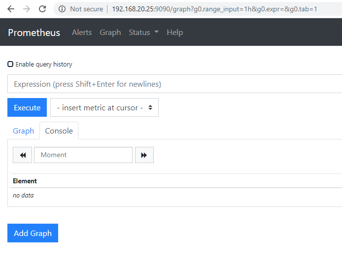

#### 2. Monitoring Using Prometheus

Steps to start the project

1. make sure you have installed `sudo apt install ansible python-pip`. then `pip install jmespath`

2. Clone the course project from `https://github.com/cloudalchemy/ansible-prometheus.git`

3. Cd into the project, make a new role, I named it `test.premetheus`, so `mkdir -p roles/test.prometheus`

4. Move related folder into the role folder, so `mv defaults/ meta/ molecule/ handlers/ tasks/ templates/ vars roles/test.prometheus/`

5. It is you `ls roles/test.prometheus/` now, you should see

```sh
osboxes@ansiblecontroller:~/ansible-prometheus$ ls roles/test.prometheus/
defaults  handlers  meta  molecule  tasks  templates  vars
```

6. under project root folder `ansible-prometheus`, create a playbook `main.yml`

```yaml
---
- hosts: all
  roles:
    - test.prometheus
  vars:
    prometheus_targets:
      node:
        - targets:
            - localhost:9100
          labels:
            env: demosite
```

7. under project root folder `ansible-prometheus`, create a inventory file `inventory`

```
localhost ansible_connection=local

```

8. Execute main.yml playbook `sudo ansible-playbook -i inventory main.yaml`

```sh
osboxes@ansiblecontroller:~/ansible-prometheus$ sudo ansible-playbook -i inventory main.yaml

PLAY [all] *********************************************************************

TASK [Gathering Facts] *********************************************************
[DEPRECATION WARNING]: Distribution Ubuntu 18.04 on host localhost should use
/usr/bin/python3, but is using /usr/bin/python for backward compatibility with
prior Ansible releases. A future Ansible release will default to using the
discovered platform python for this host. See https://docs.ansible.com/ansible/
2.9/reference_appendices/interpreter_discovery.html for more information. This
feature will be removed in version 2.12. Deprecation warnings can be disabled
by setting deprecation_warnings=False in ansible.cfg.
ok: [localhost]

TASK [test.prometheus : Gather variables for each operating system] ************
ok: [localhost] => (item=/home/osboxes/ansible-prometheus/roles/test.prometheus/vars/debian.yml)

TASK [test.prometheus : Assert usage of systemd as an init system] *************
ok: [localhost] => {
    "changed": false,
    "msg": "All assertions passed"
}

TASK [test.prometheus : Get systemd version] ***********************************
ok: [localhost]

TASK [test.prometheus : Set systemd version fact] ******************************
ok: [localhost]

TASK [test.prometheus : Assert no duplicate config flags] **********************
ok: [localhost] => {
    "changed": false,
    "msg": "All assertions passed"
}

TASK [test.prometheus : Assert external_labels aren't configured twice] ********
ok: [localhost] => {
    "changed": false,
    "msg": "All assertions passed"
}

TASK [test.prometheus : Set prometheus external metrics path] ******************
ok: [localhost]

TASK [test.prometheus : Fail when prometheus_config_flags_extra duplicates parameters set by other variables] ***
skipping: [localhost] => (item=storage.tsdb.retention)
skipping: [localhost] => (item=storage.tsdb.path)
skipping: [localhost] => (item=storage.local.retention)
skipping: [localhost] => (item=storage.local.path)
skipping: [localhost] => (item=config.file)
skipping: [localhost] => (item=web.listen-address)
skipping: [localhost] => (item=web.external-url)

TASK [test.prometheus : Get all file_sd files from scrape_configs] *************
ok: [localhost]

TASK [test.prometheus : Fail when file_sd targets are not defined in scrape_configs] ***
skipping: [localhost] => (item={'value': [{u'labels': {u'env': u'demosite'}, u'targets': [u'localhost:9100']}], 'key': u'node'})

TASK [test.prometheus : Alert when prometheus_alertmanager_config is empty, but prometheus_alert_rules is specified] ***
ok: [localhost] => {
    "msg": "No alertmanager configuration was specified. If you want your alerts to be sent make sure to specify a prometheus_alertmanager_config in defaults/main.yml.\n"
}

TASK [test.prometheus : Get latest release] ************************************
skipping: [localhost]

TASK [test.prometheus : Set prometheus version to {{ _latest_release.json.tag_name[1:] }}] ***
skipping: [localhost]

TASK [test.prometheus : Get checksum list] *************************************
ok: [localhost -> localhost]

TASK [test.prometheus : Get checksum for amd64 architecture] *******************
skipping: [localhost] => (item=1d3986c5e5cf464587d440b45dc5c44e2ee9751fc85383862831626c4ad0eb78  prometheus-2.18.1.darwin-386.tar.gz)
skipping: [localhost] => (item=e4cfcf8666f76ab1f5384671441c07758266e996b5f6fedff50e0e7d2ddc95f0  prometheus-2.18.1.darwin-amd64.tar.gz)
skipping: [localhost] => (item=52c82efaf372cf5d540c3dfefa71d1230e4fa0b947e45649d48318320bc3fe15  prometheus-2.18.1.dragonfly-amd64.tar.gz)
skipping: [localhost] => (item=267fa01d4ee2c42e0733efdc79bdd12cebcac7c565e2cab839137e1dd363bded  prometheus-2.18.1.freebsd-386.tar.gz)
skipping: [localhost] => (item=aa271b4f53bb10da57500ee2ad6648d6108d81c55704598758ef7b28c8925f3c  prometheus-2.18.1.freebsd-amd64.tar.gz)
skipping: [localhost] => (item=54b23b4ca4fdb41e004a35c9155d70fa4c0fa004341d968d0b01a97d36e45b4c  prometheus-2.18.1.freebsd-armv6.tar.gz)
skipping: [localhost] => (item=c24eb1e52de06021685cbcce7f52ea37fcad7ebddc6e64aa66c4bd9aa8de53c7  prometheus-2.18.1.freebsd-armv7.tar.gz)
skipping: [localhost] => (item=6c2410df11fc144c26b0244f6d78ed9fcfde35670ea119e372103e777590c815  prometheus-2.18.1.linux-386.tar.gz)
ok: [localhost -> localhost] => (item=5fcc35b78bd0a1b84afae6de94248a4bea3cdb4daf0d54a37b5491cb86b014d7  prometheus-2.18.1.linux-amd64.tar.gz)
skipping: [localhost] => (item=a19263eaca5975f43480589717879705706cdbc1dadc5bafef3771e237c67049  prometheus-2.18.1.linux-arm64.tar.gz)
skipping: [localhost] => (item=d497b5827a97eaea0561faadd47d1724ea84c5dec2bfbd39a8fdfdb5a86f720a  prometheus-2.18.1.linux-armv5.tar.gz)
skipping: [localhost] => (item=d678250d19e0339e212313359cd4c1d07df14d07909ae7287c0763f94075d718  prometheus-2.18.1.linux-armv6.tar.gz)
skipping: [localhost] => (item=17c2dc48bf40a27bfc6c8db3961096485a1d0307f1d04135cdedd69b7e59d579  prometheus-2.18.1.linux-armv7.tar.gz)
skipping: [localhost] => (item=d393f1b82a43aefa0b7258e7dc0c405aab22d774edd483b763725f859afddaea  prometheus-2.18.1.linux-mips64.tar.gz)
skipping: [localhost] => (item=dbaba128d58ad252cd0355c63f2f005c0e45bbcf45d28954c345d18e3c458f3c  prometheus-2.18.1.linux-mips64le.tar.gz)
skipping: [localhost] => (item=feee64ee3c943b9446f0d6dd94b941b9ae02a0dcc3a4a435b3d0e84b374e6bdc  prometheus-2.18.1.linux-ppc64.tar.gz)
skipping: [localhost] => (item=e4214d4b5ba47dd981dfc403c8a53d2dc3a346a5dcca02e68cf04ddd40fd0797  prometheus-2.18.1.linux-ppc64le.tar.gz)
skipping: [localhost] => (item=e0e8b91d45ebfd2d727dbae0eb5fb117f64764544a6bd86f92f5d3c926ef3ad4  prometheus-2.18.1.linux-s390x.tar.gz)
skipping: [localhost] => (item=35973db7739b7920ace70b54df1af76b1aa11f05739bc29812b60001f68a7158  prometheus-2.18.1.netbsd-386.tar.gz)
skipping: [localhost] => (item=2a69c81085b05dcbbde13ee9ad5b2c5633122504f80f7a751f8910f96170c21d  prometheus-2.18.1.netbsd-amd64.tar.gz)
skipping: [localhost] => (item=d336f6747a211eac2001ecf287584f58246a4af01c3f49c40e06fbe6fa43e5b6  prometheus-2.18.1.netbsd-armv6.tar.gz)
skipping: [localhost] => (item=647b802def526a0622493b54cdc43971e46bca6f2923cf55f2f67af9083c64a1  prometheus-2.18.1.netbsd-armv7.tar.gz)
skipping: [localhost] => (item=20156e2248c693ae64af350fc20f8202f1c53157f1bd1784cd9261ab6208f661  prometheus-2.18.1.openbsd-386.tar.gz)
skipping: [localhost] => (item=2c39dbb60716930a135f45e45206b49b99b6962d52e1c19030c112e3c3d16b4f  prometheus-2.18.1.openbsd-amd64.tar.gz)
skipping: [localhost] => (item=d6020cced1284f78082d33e1ecb20e27729228068ae70eb2516977964d74147a  prometheus-2.18.1.openbsd-armv7.tar.gz)
skipping: [localhost] => (item=f35360327a33467a93fdbc98a6e3eec55a9fda70df28abd7d8f925cb6feb2419  prometheus-2.18.1.windows-386.tar.gz)
skipping: [localhost] => (item=2f63908b6f769a6e55eeca80078e7a826e2df2f867307a3548c099538190ef92  prometheus-2.18.1.windows-amd64.tar.gz)

TASK [test.prometheus : create prometheus system group] ************************
changed: [localhost]

TASK [test.prometheus : create prometheus system user] *************************
changed: [localhost]

TASK [test.prometheus : create prometheus data directory] **********************
changed: [localhost]

TASK [test.prometheus : create prometheus configuration directories] ***********
changed: [localhost] => (item=/etc/prometheus)
changed: [localhost] => (item=/etc/prometheus/conf.d)
changed: [localhost] => (item=/etc/prometheus/rules)
changed: [localhost] => (item=/etc/prometheus/file_sd)

TASK [test.prometheus : download prometheus binary to local folder] ************
changed: [localhost -> localhost]

TASK [test.prometheus : unpack prometheus binaries] ****************************
changed: [localhost -> localhost]

TASK [test.prometheus : propagate official prometheus and promtool binaries] ***
changed: [localhost] => (item=prometheus)
changed: [localhost] => (item=promtool)

TASK [test.prometheus : propagate official console templates] ******************
changed: [localhost] => (item=console_libraries)
changed: [localhost] => (item=consoles)

TASK [test.prometheus : propagate locally distributed prometheus and promtool binaries] ***
skipping: [localhost] => (item=prometheus)
skipping: [localhost] => (item=promtool)

TASK [test.prometheus : create systemd service unit] ***************************
changed: [localhost]

TASK [test.prometheus : Install SELinux dependencies] **************************
skipping: [localhost] => (item=python-selinux)
skipping: [localhost] => (item=policycoreutils)

TASK [test.prometheus : Allow prometheus to bind to port in SELinux] ***********
skipping: [localhost]

TASK [test.prometheus : alerting rules file] ***********************************
changed: [localhost]

TASK [test.prometheus : copy custom alerting rule files] ***********************
[WARNING]: Unable to find 'prometheus/rules' in expected paths (use -vvvvv to
see paths)

TASK [test.prometheus : configure prometheus] **********************************
changed: [localhost]

TASK [test.prometheus : configure prometheus static targets] *******************
changed: [localhost] => (item={'value': [{u'labels': {u'env': u'demosite'}, u'targets': [u'localhost:9100']}], 'key': u'node'})

TASK [test.prometheus : copy prometheus custom static targets] *****************
[WARNING]: Unable to find 'prometheus/targets' in expected paths (use -vvvvv to
see paths)

TASK [test.prometheus : ensure prometheus service is started and enabled] ******
changed: [localhost]

RUNNING HANDLER [test.prometheus : restart prometheus] *************************
changed: [localhost]

RUNNING HANDLER [test.prometheus : reload prometheus] **************************
changed: [localhost]

PLAY RECAP *********************************************************************
localhost                  : ok=27   changed=15   unreachable=0    failed=0    skipped=9    rescued=0    ignored=0

```

9. Create a Node Exporter

you can see the download page from [here](https://prometheus.io/download/#node_exporter)

Currently the latest for Linux is [node_exporter-0.18.1.linux-amd64.tar.gz](https://github.com/prometheus/node_exporter/releases/download/v0.18.1/node_exporter-0.18.1.linux-amd64.tar.gz)

Download it by running `wget https://github.com/prometheus/node_exporter/releases/download/v0.18.1/node_exporter-0.18.1.linux-amd64.tar.gz`

Now unachieve it by running `tar xvzf node_exporter-0.18.1.linux-amd64.tar.gz`

Now to install it as a service, here are the instructions:

Create a node exporter user

```
sudo useradd -rs /bin/false node_exporter
```

Then, move it to `/usr/local/bin` by running `sudo mv node_exporter /usr/local/bin`

Apply the correct permissions to your binary file.

```sh
sudo chown node_exporter:node_exporter /usr/local/bin/node_exporter
```

Then create a new service by running `vim /etc/systemd/system/node_exporter.service`

```sh
[Unit]
Description=Node Exporter
After=network-online.target

[Service]
User=node_exporter
Group=node_exporter
Type=simple
ExecStart=/usr/local/bin/node_exporter

[Install]
WantedBy=multi-user.target
```

reload your daemon, and start your service.

```sh
sudo systemctl daemon-reload
sudo systemctl start node_exporter
```

Check your service by running the following command

```sh
sudo systemctl status node_exporter.service
```

You should be able to see something like

```sh

● node_exporter.service - Node Exporter
   Loaded: loaded (/etc/systemd/system/node_exporter.service; disabled; vendor p
   Active: active (running) since Wed 2020-05-13 22:38:34 EDT; 13s ago
 Main PID: 10123 (node_exporter)
    Tasks: 5 (limit: 2332)
   CGroup: /system.slice/node_exporter.service
           └─10123 /usr/local/bin/node_exporter

May 13 22:38:34 ansiblecontroller node_exporter[10123]: time="2020-05-13T22:38:3
May 13 22:38:34 ansiblecontroller node_exporter[10123]: time="2020-05-13T22:38:3
May 13 22:38:34 ansiblecontroller node_exporter[10123]: time="2020-05-13T22:38:3
May 13 22:38:34 ansiblecontroller node_exporter[10123]: time="2020-05-13T22:38:3
```

If it is running, then enable your service for system startup

```
sudo systemctl enable node_exporter
```

And you can verify that your node exporter is correctly up and running with a simple curl command

```sh
curl http://localhost:9100/metrics
```

If it is failed to start, for example:

```sh
Failed to start node_exporter.service: Unit node_exporter.service is not loaded properly: Invalid argument.
See system logs and 'systemctl status node_exporter.service' for details.

```

You can check system log by running:

```sh
cat /var/log/syslog
```

10. Add this metrics node to prometheus `sudo vim /etc/prometheus/prometheus.yml`

Origin: /etc/prometheus/prometheus.yml

```yaml
#
# Ansible managed
#
# http://prometheus.io/docs/operating/configuration/

global:
  evaluation_interval: 15s
  scrape_interval: 15s
  scrape_timeout: 10s

  external_labels:
    environment: ansiblecontroller

rule_files:
  - /etc/prometheus/rules/*.rules

scrape_configs:
  - job_name: prometheus
    metrics_path: /metrics
    static_configs:
      - targets:
          - ansiblecontroller:9090
  - file_sd_configs:
      - files:
          - /etc/prometheus/file_sd/node.yml
    job_name: node
```

Add:

```yml
- job_name: "node_exporter_metrics"
  scrape_interval: 5s
  static_configs:
    - targets: ["localhost:9100"]
```

After:

````yaml
Origin: /etc/prometheus/prometheus.yml

```yaml
#
# Ansible managed
#
# http://prometheus.io/docs/operating/configuration/

global:
  evaluation_interval: 15s
  scrape_interval: 15s
  scrape_timeout: 10s

  external_labels:
    environment: ansiblecontroller

rule_files:
  - /etc/prometheus/rules/*.rules

scrape_configs:
  - job_name: prometheus
    metrics_path: /metrics
    static_configs:
    - targets:
      - ansiblecontroller:9090
  - file_sd_configs:
    - files:
      - /etc/prometheus/file_sd/node.yml
    job_name: node
  - job_name: 'node_exporter_metrics'
    scrape_interval: 5s
    static_configs:
      - targets: ['localhost:9100']

````

11. Restart prometheus `sudo systemctl restart prometheus`

12. Now if you go the `http://<your_server_ip_address>:9090/graph`. You should be able to see



And go to the Stats-> Targets


You can apply filters to see the metrics you interested in


13. Setup Prometheus Grafana

```sh
sudo apt-get install -y adduser libfontconfig1
wget https://dl.grafana.com/oss/release/grafana_7.0.0-beta3_amd64.deb

sudo dpkg -i grafana_7.0.0-beta3_amd64.deb
```

```sh
Selecting previously unselected package grafana.
(Reading database ... 144775 files and directories currently installed.)
Preparing to unpack grafana_7.0.0-beta3_amd64.deb ...
Unpacking grafana (7.0.0-beta3) ...
Setting up grafana (7.0.0-beta3) ...

Adding system user `grafana' (UID 123) ...
Adding new user `grafana' (UID 123) with group `grafana' ...
Not creating home directory `/usr/share/grafana'.

### NOT starting on installation, please execute the following statements to configure grafana to start automatically using systemd
 sudo /bin/systemctl daemon-reload
 sudo /bin/systemctl enable grafana-server
### You can start grafana-server by executing
 sudo /bin/systemctl start grafana-server
Processing triggers for systemd (237-3ubuntu10.38) ...
Processing triggers for ureadahead (0.100.0-21) ...

```

While you unachieve the file, grafana has done a lot of things for setting up things. But you need to do 3 things:

```sh
sudo /bin/systemctl daemon-reload
sudo /bin/systemctl enable grafana-server

sudo /bin/systemctl start grafana-server
```

if no error, then you can go to `http://<your_server_ip_address>:3000`

Initial password is `admin:admin`

Then you can setup your data source:


6. Install ELK Services

##### 6.1 Install Elastic search (You need 4G Ram instance)

1. install `sudo apt install ansible python-pip default-jdk` (Elastic search needs default-jdk)

2. clone [elastic/ansible-elasticsearch](https://github.com/elastic/ansible-elasticsearch) [git](https://github.com/elastic/ansible-elasticsearch.git)

3. Cd into `ansible-elasticsearch`. You need to install ruby `rvm install "ruby-2.5.7"`

4. Create folder for roles `mkdir -p roles/elastic.elasticsearch`, and move related folders into roles folder

```sh
sudo mv defaults/ docs/ files/ filter_plugins/ handlers/ meta/ tasks/ templates/ test/ vars/ roles/elastic.elasticsearch/
```

5. Create a playbook file `/ansible-elasticsearch/main.yaml`

```yaml
- name: Simple Example
  hosts: localhost
  roles:
    - role: elastic.elasticsearch
  vars:
    es_version: 7.7.0
```

6. Create inventory file `/ansible-elasticsearch/inventory`

```
localhost ansible_connection=local
```

7. Execute the playbook file `sudo ansible-playbook -i inventory main.yaml`

```sh
ubuntu:~/environment/ansible-elasticsearch (master) $ sudo ansible-playbook -i inventory main.yaml

PLAY [Simple Example] ******************************************************************************************************************************************************************************************************************************

TASK [Gathering Facts] *****************************************************************************************************************************************************************************************************************************
ok: [localhost]

TASK [elastic.elasticsearch : set_fact] ************************************************************************************************************************************************************************************************************
ok: [localhost]

TASK [elastic.elasticsearch : os-specific vars] ****************************************************************************************************************************************************************************************************
ok: [localhost]

TASK [elastic.elasticsearch : Set the defaults here otherwise they can't be overriden in the same play if the role is called twice] ****************************************************************************************************************
ok: [localhost]

TASK [elastic.elasticsearch : Use the oss repo and package if xpack is not being used] *************************************************************************************************************************************************************
skipping: [localhost]

TASK [elastic.elasticsearch : Set the URL scheme to https if SSL/TLS is enabled] *******************************************************************************************************************************************************************
skipping: [localhost]

TASK [elastic.elasticsearch : fail when es_proxy_port is not defined or is blank] ******************************************************************************************************************************************************************
skipping: [localhost]

TASK [elastic.elasticsearch : fail when heap size is not specified when using memory lock] *********************************************************************************************************************************************************
skipping: [localhost]

TASK [elastic.elasticsearch : fail when api credentials are not declared when using security] ******************************************************************************************************************************************************
skipping: [localhost]

TASK [elastic.elasticsearch : fail when ssl enabled without defining a key and certificate] ********************************************************************************************************************************************************
skipping: [localhost]

TASK [elastic.elasticsearch : set fact file_reserved_users] ****************************************************************************************************************************************************************************************
skipping: [localhost]

TASK [elastic.elasticsearch : fail when changing users through file realm] *************************************************************************************************************************************************************************
skipping: [localhost]

TASK [elastic.elasticsearch : set fact m_lock_enabled] *********************************************************************************************************************************************************************************************
ok: [localhost]

TASK [elastic.elasticsearch : set fact use_system_d] ***********************************************************************************************************************************************************************************************
ok: [localhost]

TASK [elastic.elasticsearch : detect if we need the .deb or .rpm] **********************************************************************************************************************************************************************************
skipping: [localhost]

TASK [elastic.elasticsearch : get the minor version] ***********************************************************************************************************************************************************************************************
skipping: [localhost]

TASK [elastic.elasticsearch : set the package_name] ************************************************************************************************************************************************************************************************
skipping: [localhost]

TASK [elastic.elasticsearch : generate the artifacts url] ******************************************************************************************************************************************************************************************
skipping: [localhost]

TASK [elastic.elasticsearch : get latest snapshot build] *******************************************************************************************************************************************************************************************
skipping: [localhost]

TASK [elastic.elasticsearch : use the custom package url instead of the repository] ****************************************************************************************************************************************************************
skipping: [localhost]

TASK [elastic.elasticsearch : split up the snapshot url so we can create the plugin url] ***********************************************************************************************************************************************************
skipping: [localhost]

TASK [elastic.elasticsearch : set base plugin url] *************************************************************************************************************************************************************************************************
skipping: [localhost]

TASK [elastic.elasticsearch : create es_plugins with the snapshot url] *****************************************************************************************************************************************************************************
skipping: [localhost]

TASK [elastic.elasticsearch : override the original es_plugins with the snapshot version] **********************************************************************************************************************************************************
skipping: [localhost]

TASK [elastic.elasticsearch : set fact java_state to present] **************************************************************************************************************************************************************************************
skipping: [localhost]

TASK [elastic.elasticsearch : set fact java_state to latest] ***************************************************************************************************************************************************************************************
skipping: [localhost]

TASK [elastic.elasticsearch : RedHat - Ensure Java is installed] ***********************************************************************************************************************************************************************************
skipping: [localhost]

TASK [elastic.elasticsearch : Get the installed java path] *****************************************************************************************************************************************************************************************
skipping: [localhost]

TASK [elastic.elasticsearch : correct java version selected] ***************************************************************************************************************************************************************************************
skipping: [localhost]

TASK [elastic.elasticsearch : Refresh java repo] ***************************************************************************************************************************************************************************************************
skipping: [localhost]

TASK [elastic.elasticsearch : Debian - Ensure Java is installed] ***********************************************************************************************************************************************************************************
skipping: [localhost]

TASK [elastic.elasticsearch : register open_jdk version] *******************************************************************************************************************************************************************************************
skipping: [localhost]

TASK [elastic.elasticsearch : refresh the java ca-certificates] ************************************************************************************************************************************************************************************
skipping: [localhost]

TASK [elastic.elasticsearch : set fact force_install to no] ****************************************************************************************************************************************************************************************
ok: [localhost]

TASK [elastic.elasticsearch : set fact force_install to yes] ***************************************************************************************************************************************************************************************
skipping: [localhost]

TASK [elastic.elasticsearch : Check if the elasticsearch package is installed] *********************************************************************************************************************************************************************
ok: [localhost]

TASK [elastic.elasticsearch : unhold elasticsearch package when switching to a different package type] *********************************************************************************************************************************************
skipping: [localhost]

TASK [elastic.elasticsearch : stop elasticsearch] **************************************************************************************************************************************************************************************************
skipping: [localhost]

TASK [elastic.elasticsearch : Debian - Remove elasticsearch package if we are switching to a different package type] *******************************************************************************************************************************
skipping: [localhost]

TASK [elastic.elasticsearch : Debian - Install apt-transport-https to support https APT downloads] *************************************************************************************************************************************************
ok: [localhost]

TASK [elastic.elasticsearch : Debian - Add Elasticsearch repository key] ***************************************************************************************************************************************************************************
changed: [localhost]

TASK [elastic.elasticsearch : Debian - Add elasticsearch repository] *******************************************************************************************************************************************************************************
ok: [localhost] => (item={u'repo': u'deb http://packages.elastic.co/elasticsearch/7.x/debian stable main', u'state': u'absent'})
changed: [localhost] => (item={u'repo': u'deb https://artifacts.elastic.co/packages/7.x/apt stable main', u'state': u'present'})
ok: [localhost] => (item={u'repo': u'deb https://artifacts.elastic.co/packages/oss-7.x/apt stable main', u'state': u'absent'})

TASK [elastic.elasticsearch : Ensure optional elasticsearch group is created with the correct id.] *************************************************************************************************************************************************
skipping: [localhost]

TASK [elastic.elasticsearch : Ensure optional elasticsearch user is created with the correct id.] **************************************************************************************************************************************************
skipping: [localhost]

TASK [elastic.elasticsearch : Debian - Get installed elasticsearch version] ************************************************************************************************************************************************************************
ok: [localhost]

TASK [elastic.elasticsearch : Debian - unhold elasticsearch version] *******************************************************************************************************************************************************************************
changed: [localhost]

TASK [elastic.elasticsearch : Debian - Ensure elasticsearch is installed] **************************************************************************************************************************************************************************
changed: [localhost]

TASK [elastic.elasticsearch : Debian - hold elasticsearch version] *********************************************************************************************************************************************************************************
skipping: [localhost]

TASK [elastic.elasticsearch : Debian - Download elasticsearch from url] ****************************************************************************************************************************************************************************
skipping: [localhost]

TASK [elastic.elasticsearch : Debian - Ensure elasticsearch is installed from downloaded package] **************************************************************************************************************************************************
skipping: [localhost]

TASK [elastic.elasticsearch : set fact allow_downgrade to no] **************************************************************************************************************************************************************************************
skipping: [localhost]

TASK [elastic.elasticsearch : set fact allow_downgrade to yes] *************************************************************************************************************************************************************************************
skipping: [localhost]

TASK [elastic.elasticsearch : Ensure libselinux-python on CentOS 6.x] ******************************************************************************************************************************************************************************
skipping: [localhost]

TASK [elastic.elasticsearch : RedHat - add Elasticsearch repo] *************************************************************************************************************************************************************************************
skipping: [localhost]

TASK [elastic.elasticsearch : RedHat - remove unused Elasticsearch repo] ***************************************************************************************************************************************************************************
skipping: [localhost]

TASK [elastic.elasticsearch : RedHat - install yum-version-lock] ***********************************************************************************************************************************************************************************
skipping: [localhost]

TASK [elastic.elasticsearch : RedHat - check if requested elasticsearch version lock exists] *******************************************************************************************************************************************************
skipping: [localhost]

TASK [elastic.elasticsearch : RedHat - lock elasticsearch version] *********************************************************************************************************************************************************************************
skipping: [localhost]

TASK [elastic.elasticsearch : RedHat - check if any elasticsearch version lock exists] *************************************************************************************************************************************************************
skipping: [localhost]

TASK [elastic.elasticsearch : RedHat - unlock elasticsearch version] *******************************************************************************************************************************************************************************
skipping: [localhost]

TASK [elastic.elasticsearch : RedHat - Remove the other elasticsearch package if switching between OSS and standard] *******************************************************************************************************************************
skipping: [localhost]

TASK [elastic.elasticsearch : Ensure optional elasticsearch group is created with the correct id.] *************************************************************************************************************************************************
skipping: [localhost]

TASK [elastic.elasticsearch : Ensure optional elasticsearch user is created with the correct id.] **************************************************************************************************************************************************
skipping: [localhost]

TASK [elastic.elasticsearch : RedHat - Install Elasticsearch] **************************************************************************************************************************************************************************************
skipping: [localhost]

TASK [elastic.elasticsearch : RedHat - Install Elasticsearch from url] *****************************************************************************************************************************************************************************
skipping: [localhost]

TASK [elastic.elasticsearch : Create Configuration Directory] **************************************************************************************************************************************************************************************
ok: [localhost]

TASK [elastic.elasticsearch : Create PID Directory] ************************************************************************************************************************************************************************************************
changed: [localhost]

TASK [elastic.elasticsearch : Create Others Directories] *******************************************************************************************************************************************************************************************
ok: [localhost] => (item=/var/log/elasticsearch)
ok: [localhost] => (item=/var/lib/elasticsearch)

TASK [elastic.elasticsearch : Copy Configuration File] *********************************************************************************************************************************************************************************************
changed: [localhost]

TASK [elastic.elasticsearch : Copy Default File] ***************************************************************************************************************************************************************************************************
changed: [localhost]

TASK [elastic.elasticsearch : Make sure destination dir exists] ************************************************************************************************************************************************************************************
skipping: [localhost]

TASK [elastic.elasticsearch : Copy specific ElasticSearch Systemd config file] *********************************************************************************************************************************************************************
skipping: [localhost]

TASK [elastic.elasticsearch : Copy jvm.options File] ***********************************************************************************************************************************************************************************************
changed: [localhost]

TASK [elastic.elasticsearch : Copy log4j2.properties File] *****************************************************************************************************************************************************************************************
skipping: [localhost]

TASK [elastic.elasticsearch : set fact es_plugins_reinstall to true] *******************************************************************************************************************************************************************************
skipping: [localhost]

TASK [elastic.elasticsearch : set fact list_command] ***********************************************************************************************************************************************************************************************
skipping: [localhost]

TASK [elastic.elasticsearch : set fact list_command check for x-pack] ******************************************************************************************************************************************************************************
skipping: [localhost]

TASK [elastic.elasticsearch : remove x-pack plugin directory when it isn't a plugin] ***************************************************************************************************************************************************************
skipping: [localhost]

TASK [elastic.elasticsearch : Check installed elasticsearch plugins] *******************************************************************************************************************************************************************************
skipping: [localhost]

TASK [elastic.elasticsearch : set fact plugins_to_remove to install_plugins.stdout_lines] **********************************************************************************************************************************************************
skipping: [localhost]

TASK [elastic.elasticsearch : set fact plugins_to_remove to delete plugins installed but not listed in es_plugins] *********************************************************************************************************************************
skipping: [localhost]

TASK [elastic.elasticsearch : set fact plugins_to_install to es_plugins] ***************************************************************************************************************************************************************************
skipping: [localhost]

TASK [elastic.elasticsearch : set fact to plugins_to_install to those in es_config but not installed] **********************************************************************************************************************************************
skipping: [localhost]

TASK [elastic.elasticsearch : Remove elasticsearch plugins] ****************************************************************************************************************************************************************************************

TASK [elastic.elasticsearch : Install elasticsearch plugins] ***************************************************************************************************************************************************************************************
skipping: [localhost]

TASK [elastic.elasticsearch : create the keystore if it doesn't exist yet] *************************************************************************************************************************************************************************
ok: [localhost]

TASK [elastic.elasticsearch : Check if bootstrap password is set] **********************************************************************************************************************************************************************************
ok: [localhost]

TASK [elastic.elasticsearch : Create Bootstrap password for elastic user] **************************************************************************************************************************************************************************
skipping: [localhost]

TASK [elastic.elasticsearch : set_fact] ************************************************************************************************************************************************************************************************************
skipping: [localhost]

TASK [elastic.elasticsearch : set_fact] ************************************************************************************************************************************************************************************************************
skipping: [localhost]

TASK [elastic.elasticsearch : Check if old users file exists] **************************************************************************************************************************************************************************************
skipping: [localhost]

TASK [elastic.elasticsearch : Copy the old users file from the old deprecated location] ************************************************************************************************************************************************************
skipping: [localhost]

TASK [elastic.elasticsearch : List Users] **********************************************************************************************************************************************************************************************************
skipping: [localhost]

TASK [elastic.elasticsearch : set fact users_to_remove] ********************************************************************************************************************************************************************************************
skipping: [localhost]

TASK [elastic.elasticsearch : Remove Users] ********************************************************************************************************************************************************************************************************

TASK [elastic.elasticsearch : set fact users_to_add] ***********************************************************************************************************************************************************************************************
skipping: [localhost]

TASK [elastic.elasticsearch : Add Users] ***********************************************************************************************************************************************************************************************************
skipping: [localhost]

TASK [elastic.elasticsearch : Set User Passwords] **************************************************************************************************************************************************************************************************
skipping: [localhost]

TASK [elastic.elasticsearch : set fact users_roles] ************************************************************************************************************************************************************************************************
skipping: [localhost]

TASK [elastic.elasticsearch : Copy roles.yml File for Instance] ************************************************************************************************************************************************************************************
skipping: [localhost]

TASK [elastic.elasticsearch : Copy User Roles] *****************************************************************************************************************************************************************************************************
skipping: [localhost]

TASK [elastic.elasticsearch : Copy role_mapping.yml file for instance] *****************************************************************************************************************************************************************************
skipping: [localhost]

TASK [elastic.elasticsearch : Set elasticsearch.keystore Permissions] ******************************************************************************************************************************************************************************
ok: [localhost]

TASK [elastic.elasticsearch : set fact es_same_keystore] *******************************************************************************************************************************************************************************************
skipping: [localhost]

TASK [elastic.elasticsearch : set fact es_same_keystore if stores match] ***************************************************************************************************************************************************************************
skipping: [localhost]

TASK [elastic.elasticsearch : ensure certificate directory exists] *********************************************************************************************************************************************************************************
skipping: [localhost]

TASK [elastic.elasticsearch : Upload SSL/TLS keystore] *********************************************************************************************************************************************************************************************
skipping: [localhost]

TASK [elastic.elasticsearch : Upload SSL/TLS truststore] *******************************************************************************************************************************************************************************************
skipping: [localhost]

TASK [elastic.elasticsearch : Upload SSL/TLS key and certificate] **********************************************************************************************************************************************************************************
skipping: [localhost] => (item=)
skipping: [localhost] => (item=)

TASK [elastic.elasticsearch : Upload SSL Certificate Authority] ************************************************************************************************************************************************************************************
skipping: [localhost]

TASK [elastic.elasticsearch : Set keystore password] ***********************************************************************************************************************************************************************************************
skipping: [localhost] => (item=None)
skipping: [localhost] => (item=None)
skipping: [localhost]

TASK [elastic.elasticsearch : Set truststore password] *********************************************************************************************************************************************************************************************
skipping: [localhost] => (item=None)
skipping: [localhost] => (item=None)
skipping: [localhost]

TASK [elastic.elasticsearch : Remove keystore password] ********************************************************************************************************************************************************************************************
skipping: [localhost] => (item=http)
skipping: [localhost] => (item=transport)

TASK [elastic.elasticsearch : Remove truststore password] ******************************************************************************************************************************************************************************************
skipping: [localhost] => (item=http)
skipping: [localhost] => (item=transport)

TASK [elastic.elasticsearch : Set key password] ****************************************************************************************************************************************************************************************************
skipping: [localhost] => (item=None)
skipping: [localhost] => (item=None)
skipping: [localhost]

TASK [elastic.elasticsearch : Remove key password] *************************************************************************************************************************************************************************************************
skipping: [localhost] => (item=http)
skipping: [localhost] => (item=transport)

RUNNING HANDLER [elastic.elasticsearch : restart elasticsearch] ************************************************************************************************************************************************************************************
changed: [localhost]

TASK [elastic.elasticsearch : Make sure elasticsearch is started] **********************************************************************************************************************************************************************************
ok: [localhost]

TASK [elastic.elasticsearch : Wait for elasticsearch to startup] ***********************************************************************************************************************************************************************************
ok: [localhost]

TASK [elastic.elasticsearch : set fact manage_native_realm to false] *******************************************************************************************************************************************************************************
ok: [localhost]

TASK [elastic.elasticsearch : set fact manage_native_realm to true] ********************************************************************************************************************************************************************************
skipping: [localhost]

TASK [elastic.elasticsearch : Wait 15 seconds for the Native Realm to come up] *********************************************************************************************************************************************************************
skipping: [localhost]

TASK [elastic.elasticsearch : Activate ES license (with security authentication)] ******************************************************************************************************************************************************************
skipping: [localhost]

TASK [elastic.elasticsearch : License] *************************************************************************************************************************************************************************************************************
skipping: [localhost]

TASK [elastic.elasticsearch : Activate ES trial license (with security authentication)] ************************************************************************************************************************************************************
skipping: [localhost]

TASK [elastic.elasticsearch : Trial license] *******************************************************************************************************************************************************************************************************
skipping: [localhost]

TASK [elastic.elasticsearch : set fact change_api_password to false] *******************************************************************************************************************************************************************************
skipping: [localhost]

TASK [elastic.elasticsearch : set fact manage_native_users to false] *******************************************************************************************************************************************************************************
skipping: [localhost]

TASK [elastic.elasticsearch : set fact manage_native_users to true] ********************************************************************************************************************************************************************************
skipping: [localhost]

TASK [elastic.elasticsearch : set fact manage_native_role to false] ********************************************************************************************************************************************************************************
skipping: [localhost]

TASK [elastic.elasticsearch : set fact manange_native_roles to true] *******************************************************************************************************************************************************************************
skipping: [localhost]

TASK [elastic.elasticsearch : List Native Users] ***************************************************************************************************************************************************************************************************
skipping: [localhost]

TASK [elastic.elasticsearch : set fact reserved_users equals user_list_response.json] **************************************************************************************************************************************************************
skipping: [localhost]

TASK [elastic.elasticsearch : set fact current_users equals user_list_response.json.keys not including reserved] ***********************************************************************************************************************************
skipping: [localhost]

TASK [elastic.elasticsearch : set fact native_users] ***********************************************************************************************************************************************************************************************
skipping: [localhost]

TASK [elastic.elasticsearch : set fact change_api_password to true] ********************************************************************************************************************************************************************************
skipping: [localhost]

TASK [elastic.elasticsearch : Update API User Password] ********************************************************************************************************************************************************************************************
skipping: [localhost]

TASK [elastic.elasticsearch : set fact es_api_basic_auth_password] *********************************************************************************************************************************************************************************
skipping: [localhost]

TASK [elastic.elasticsearch : set fact users_to_remove] ********************************************************************************************************************************************************************************************
skipping: [localhost]

TASK [elastic.elasticsearch : Delete Native Users] *************************************************************************************************************************************************************************************************

TASK [elastic.elasticsearch : set fact users_to_ignore] ********************************************************************************************************************************************************************************************
skipping: [localhost]

TASK [elastic.elasticsearch : debug message] *******************************************************************************************************************************************************************************************************
skipping: [localhost]

TASK [elastic.elasticsearch : Update Reserved User Passwords] **************************************************************************************************************************************************************************************
skipping: [localhost]

TASK [elastic.elasticsearch : set fact users_to_modify] ********************************************************************************************************************************************************************************************
skipping: [localhost]

TASK [elastic.elasticsearch : Update Non-Reserved Native User Details] *****************************************************************************************************************************************************************************
skipping: [localhost]

TASK [elastic.elasticsearch : List Native Roles] ***************************************************************************************************************************************************************************************************
skipping: [localhost]

TASK [elastic.elasticsearch : set fact reserved roles] *********************************************************************************************************************************************************************************************
skipping: [localhost]

TASK [elastic.elasticsearch : set fact current roles] **********************************************************************************************************************************************************************************************
skipping: [localhost]

TASK [elastic.elasticsearch : set fact roles to ignore] ********************************************************************************************************************************************************************************************
skipping: [localhost]

TASK [elastic.elasticsearch : debug message] *******************************************************************************************************************************************************************************************************
skipping: [localhost]

TASK [elastic.elasticsearch : set fact roles_to_remove] ********************************************************************************************************************************************************************************************
skipping: [localhost]

TASK [elastic.elasticsearch : Delete Native Roles] *************************************************************************************************************************************************************************************************

TASK [elastic.elasticsearch : set fact roles_to_modify] ********************************************************************************************************************************************************************************************
skipping: [localhost]

TASK [elastic.elasticsearch : Update Native Roles] *************************************************************************************************************************************************************************************************

TASK [elastic.elasticsearch : ensure templates dir is created] *************************************************************************************************************************************************************************************
skipping: [localhost]

TASK [elastic.elasticsearch : Copy templates to elasticsearch] *************************************************************************************************************************************************************************************

TASK [elastic.elasticsearch : Install templates] ***************************************************************************************************************************************************************************************************

PLAY RECAP *****************************************************************************************************************************************************************************************************************************************
localhost                  : ok=27   changed=9    unreachable=0    failed=0
```

#### Setup Kibana

1. install kibana `sudo apt install kibana`

2. install nginx and configure it as a reverse proxy for kibana

```sh

sudo apt install nginx

```

and setup nginx as reverse proxy `sudo vim /etc/nginx/sites-enabled/default`

/etc/nginx/sites-enabled/default

```
server {
    listen 80;

    server_name _;

    auth_basic "Restricted Access";
    auth_basic_user_file /etc/nginx/htpasswd.users;

    location / {
        proxy_pass http://localhost:5601;
        proxy_http_version 1.1;
        proxy_set_header Upgrade $http_upgrade;
        proxy_set_header Connection 'upgrade';
        proxy_set_header Host $host;
        proxy_cache_bypass $http_upgrade;
    }
}

```

Now you need to create a user/password for nginx auth

```sh
echo "kibadmin:`openssl passwd -apr1`" | sudo tee -a /etc/nginx/htpasswd.users
```

Type a password, then verify again

3. Change /etc/kibana/kibana.yml username/password `sudo vim /etc/kibana/kibana.yml`

/etc/kibana/kibana.yml

```yaml
elasticsearch.username: "elastic"
elasticsearch.password: "none"
```

When first time login, enter your `kibadmin@<your_password>` to login

Now check the status of Kibana, Elastic Search and nginx

If all good, then restart those services

```sh
sudo systemctl enable kibana
sudo systemctl enable elasticsearch
sudo systemctl enable nginx

sudo systemctl restart kibana
sudo systemctl restart elasticsearch
sudo systemctl restart nginx
```

Now you should be able to login from `<your_vm_ip_address>`


#### Logstash

1. Installation

```
curl -L -O https://artifacts.elastic.co/downloads/beats/filebeat/filebeat-7.7.0-amd64.deb
sudo dpkg -i filebeat-7.7.0-amd64.deb
```

2. modify /etc/filebeat/filebeat.yml by running `sudo vim /etc/filebeat/filebeat.yml`

A few key sections:

- For which log files to collect

```
#=========================== Filebeat inputs =============================

filebeat.inputs:

# Each - is an input. Most options can be set at the input level, so
# you can use different inputs for various configurations.
# Below are the input specific configurations.

- type: log

  # Change to true to enable this input configuration.
  enabled: true

  # Paths that should be crawled and fetched. Glob based paths.
  paths:
    - /var/log/*.log
    #- c:\programdata\elasticsearch\logs\*

```

- Kibana

```

#============================== Kibana =====================================

# Starting with Beats version 6.0.0, the dashboards are loaded via the Kibana API.
# This requires a Kibana endpoint configuration.
setup.kibana:

  # Kibana Host
  # Scheme and port can be left out and will be set to the default (http and 5601)
  # In case you specify and additional path, the scheme is required: http://localhost:5601/path
  # IPv6 addresses should always be defined as: https://[2001:db8::1]:5601
  host: "localhost:5601"

  # Kibana Space ID
  # ID of the Kibana Space into which the dashboards should be loaded. By default,
  # the Default Space will be used.
  #space.id:

```

- Elasticsearch output

```
#-------------------------- Elasticsearch output ------------------------------
output.elasticsearch:
  # Array of hosts to connect to.
  hosts: ["localhost:9200"]

  # Protocol - either `http` (default) or `https`.
  #protocol: "https"
  username: "elastic"
  passoword: "none"

  # Authentication credentials - either API key or username/password.
  #api_key: "id:api_key"
  #username: "elastic"
  #password: "changeme"

```

3. Enable and configure the logstash module

```
sudo filebeat modules enable logstash
```

4. Start filebeat service

```
 sudo systemctl restart filebeat
 sudo systemctl enable filebeat

```

5. Now go to Kabana dashboard -> Discover. Choose `filebeat-*`


