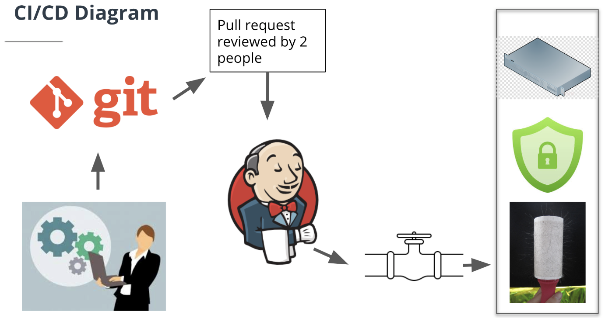

#### Lesson 1: Continues Integration and Continues Deployment

#### 2. Course Overview

Course Objectives
In this course, you will learn the fundamentals of Continuous Integration and Continuous Deployment (CI/CD) subject matters, such as Jenkins, Pipelines, Prometheus, and Ansible. After completing the course, you will be able to:

- Explain the fundamentals of CI/CD and Jenkins as a framework to achieve automation in CI/CD. Lesson 1 introduces Jenkins for building, testing, and delivering or deploying software.
- Make use of various Jenkins Plugins and Deployment Strategies to boost your CI/CD requirements. Lesson 2 will demonstrate to install and configure Blue Ocean, Aqua MicroScanner plugins for CI/CD pipeline. It will discuss several Deployment Strategies, as well.
- Utilize Ansible as a configuration management tool. Lesson 3 describes the basics of Ansible, such as Templates, Services, Conditionals, and Roles. It will demonstrate to run Ansible to provision the target infrastructure using code (infrastructure as code) .
- Make use of monitoring and log aggregation tools. Lesson 4 will guide you to install, configure, and use the Prometheus tool and ELK services.

Project Overview
The end of this course will lead to a project where you can show your acquired skills taught in this course. In our project, you will deploy and run an instance on AWS, configure Jenkins, and create a pipeline to deploy a static website on S3.

Lesson Objectives
After completing this lesson, you will be able to:

- Explain the fundamentals of CI/CD and pipelines
- Setup the prerequisites for Jenkins, such as AWS IAM user, EC2 instance, and S3 services
- Install and configure Jenkins as automation server to build a pipeline
- Describe the role of Jenkinsfile
- Install Blue Ocean plugin into Jenkins

#### 4. What is CI/CD and a Pipeline?

Background - What is DevOps?
We have learned in the previous course that DevOps is the combination of industry best practices, and set of tools that improve an organization’s ability to: \*Increase the speed of software delivery

Increases the speed of software evolution
Have better reliability of the software
Have scalability using automation,
Improved collaboration among teams. The two most important practices are - Continuous Integration / Continuous Delivery or Deployment (CI/CD) and Infrastructure as Code (IaaC).

What is CI/CD?
CI/CD is a consistent and automated way for a DevOps team to build, package, test, and deploy applications

- Continuous Integration means newly developed code changes of a project are periodically built, tested, and integrated into a shared repository like Git. Then, the integrated code is verified and tested using automated tools.

- Continuous Delivery is the process of automating the release of the merged and validated code to a repository and finally release a production-ready build to the production environment.



**Pipelines Overview**
One of the key best practices of DevOps is to be able to do “Infrastructure as Code”. A Pipeline enables us to store our Jenkins project configuration as code in a Git repository. A Pipeline is a set of tools and processes to automate the CI/CD.

The previous way of doing this was to store the configurations as text on the Jenkins server. However, it is far superior to store this in a Git repository, because that way we version it, review it, perform pull requests, and integrate it just like the rest of our code.

A pipeline contains steps that have different actions performed as part of those steps. Pipelines are written in Groovy code and designed to be reusable. Pipelines can be used similarly to how programming languages use “Modules” in a pluggable manner. The value in a Pipeline is it enables advanced functionality above and beyond simple Bash scripting. There are additional programmatic controls such as try and catch. A try/catch block creates a means of responding to errors in code or data for Jenkins functions. Pipelines assist with performing code testing and verification due to their modular nature and try/catch routines. This enables advanced error handling which lends itself to complex functionality.


As shown in the figure above, CI/CD pipeline implementation is the backbone of the modern DevOps environment. With pipelines we are able to use code checked into a Git repository to control the execution, linting, security testing, and performance testing of code. We use different environments to perform different functions, such as - development environment for building the code, staging environment for testing, and production environment for deployment.

### 8. Jenkins Intro

What is Jenkins?
To "expedite" the software development process, CI/CD has become an essential practice for rapid building, testing, and deployment. Jenkins is an automation server that is used to automate the tasks associated with CI/CD, such as building, testing, and deploying the application.

Jenkins comes originally from the Hudson project, which had very similar features and functionality but was controlled by Sun Microsystems. Jenkins is an open-source tool that was released in 2011. Jenkins is written in Java language. The prime feature of Jenkins is Jenkins Pipeline.

What is Jenkins Pipeline?
In general, a Pipeline is a set of tools and processes to automate the CI/CD of a software application. Jenkins Pipeline is a set of plugins that assist in achieving continuous delivery. Jenkins is highly modular and supports a multitude of plugins. Plugins extend Jenkins with additional features to support various requirements. We will cover a few of the plugins at a higher level in the next lesson.

**Jenkinsfile**
`Jenkinsfile` is a text file that contains the definition of a Jenkins Pipeline. This text file is stored into the application’s Source Control Repository e.g., Github. Storing the Jenkinsfile into a source control repository makes it possible to review and audit collaboratively. A Jenkinsfile can be written using two types of syntax - Declarative and Scripted. In this course, we will use the Declarative way to write `Jenkinsfile` .


Recommended Read
Jenkins provides Guided Tours, Tutorials, and Handbook documentation.
Read the [handbook documentation for Pipeline](https://jenkins.io/doc/book/pipeline/). The snapshot below highlights the topics that would provide insight into the Pipeline.
We suggest to read the Handbook first, and then go through the last two tutorials - “Create a Pipeline in Blue Ocean” and “End-to-End Multibranch Pipeline Project Creation”, later in this course.

AWS Pipeline Service [OPTIONAL TO READ]
AWS offers a CI/CD pipeline service, named as “CodePipeline”. This service can be used to model, visualize, as well as automate the steps required to release software. AWS CodePipeline enables us to increase the speed and quality of our development. It also runs a set of quality checks to ensure consistency. As a part of our project, we will need to provision (spinning-up) VMs in the cloud and use the service(s) of AWS.

AWS CodeBuild and AWS CodeDeploy are the two most relevant services that are useful as a part of DevOps. AWS offers a plethora of other services, and you can see an implementation guide to set up a CI/CD pipeline on AWS [here](https://aws.amazon.com/getting-started/projects/set-up-ci-cd-pipeline/?trk=gs_card).

#### 9. Connect to EC2 Instance using SSH

Unix/Linux/Mac users
Unix/Linux/Mac users can log into your EC2 instance using Secure Shell (SSH) client. The following are the steps:

1. Open an SSH client.
2. Locate the private key .pem file in your local machine, and change the permissions to hide it from public for SSH to work, using the command
   `chmod 400 <path of private key .pem file locally>`
3. The default username for Ubuntu VMs is ‘ubuntu@` . Note the public IP address or public DNS of your EC2 instance. See the snapshot below to determine the public IP and DNS of your EC2 instance.
4. Connect to your instance using its public IP address, using `ssh ubuntu@3.86.197.149 -i <path of private key .pem file locally>` in your terminal. Alternatively, you can use the public DNS, as `ssh -i <path of private key .pem file locally> <public DNS>`.

#### 10. Install

Commands for Installing Jenkins on an EC2 instance

```sh
# Step 1 - Update existing packages
sudo apt-get update

# Step 2 - Install Java
sudo apt install -y default-jdk

# Step 3 - Download Jenkins package.
# You can go to http://pkg.jenkins.io/debian/ to see the available commands
# First, add a key to your system
wget -q -O - https://pkg.jenkins.io/debian-stable/jenkins.io.key | sudo apt-key add -

# # Step 4 - Add the following entry in your /etc/apt/sources.list:
sudo sh -c 'echo deb https://pkg.jenkins.io/debian-stable binary/ > /etc/apt/sources.list.d/jenkins.list'

# # Step 5 -Update your local package index
sudo apt-get update

# Step 6 - Install Jenkins
sudo apt-get install -y jenkins

# Step 7 - Start the Jenkins server
sudo systemctl start jenkins

# Step 8 - Enable the service to load during boot
sudo systemctl enable jenkins
```

To start, stop or restart jenkins

```bash
$ sudo systemctl start jenkins.service
$ sudo systemctl stop jenkins.service
$ sudo systemctl restart jenkins.service
```

You also need node.js and docker

Node.js v12.x: [Node.js Binary Distributions](https://github.com/nodesource/distributions)

```
# Using Ubuntu
curl -sL https://deb.nodesource.com/setup_12.x | sudo -E bash -
sudo apt-get install -y nodejs
```

Install docker

```
sudo apt install docker.io

sudo systemctl start docker

sudo systemctl start docker

sudo systemctl enable docker

sudo usermod -aG docker $USER

# add jenkins to docker group
sudo usermod -aG docker jenkins

# you MUST restart jenkins service
sudo systemctl restart jenkins.service
```

Or you can use Jenkins docker image

```sh
docker run --name jenkins -p 8080:8080 -p 50000:50000 -v jenkins_home:/var/jenkins_home --detach jenkins/jenkins:lts
```

this will automatically create a 'jenkins_home' docker volume on the host machine, that will survive the container stop/restart/deletion.

Note:
If you need to install any packages on the `jenkins/jenkins:lts` image, better you create your custom image base on that

```dockerfile
FROM jenkins
USER root
CMD apt-get install xxxx
USER jenkins
```

But **for simplicity**, you can sh into the running jenkins container as root user:

```bash
docker exec -u 0 -it jenkins bash
```

Then as a root user, you can apt install basically everything you need. for example: `tidy` for html lint

```bash
apt install tidy -y
```

install docker

```bash
curl -sSL https://get.docker.com/ | sh
```

install npm via nvm

```bash
curl -sL https://raw.githubusercontent.com/creationix/nvm/v0.33.11/install.sh -o install_nvm.sh
```

then

```bash
bash install_nvm.sh

source ~/.profile

nvm ls-remote # check available versions

nvm install 10.20.1
nvm use 10.20.1
```

Logging into Jenkins using GUI

- Go to AWS dashboard to copy the public IP address of your Ubuntu EC2 instance.

- Paste the public IP address into your browser, appended with :8080 port. For the first time, it will open up the Jenkins GUI as shown in the snapshot below:


- On the terminal, where you have connected to the Ubuntu EC2 instance, view the content of the file using the command sudo cat <path copied in the previous step>. It will show the default administrator password. You can copy and use this password in the GUI (browser) to log in first time.

- After successful login, you may choose to install default plugins. Though, we will learn to use specific plugins for our needs in the next lesson. See the snapshot below.


- If you choose to install suggested plugins, the following plugins would get installed. See the snapshot below:


- Set up the user credentials. See the snapshot below:


- Next, it will show you a success message and take you to the Jenkins dashboard.


#### 11. Install Blue Ocean Plugin into Jenkins

Jenkins Plugins
Jenkins supports a plenitude of plugins. Plugins extend Jenkins with additional features to support various requirements. Here we will install the Blue Ocean Plugin into Jenkins. The general sequence of steps to select and install any plugin into Jenkins are:

Jenkins dashboard --> Manage Jenkins --> Manage Plugins --> Available tab --> Filter out using a keyword

Blue Ocean Plugin
[Blue Ocean](https://jenkins.io/doc/book/blueocean/) essentially provides a re-skinned and simplified GUI for working with Jenkins. Blue Ocean can help you configure your pipeline using a few clicks.

Configure Jenkins for Enterprise Authentication with LDAP

- In the Jenkins GUI click on “Manage Jenkins”
- Click the lock icon “Configure Global Security”
- Select the checkbox “Enable Security”
- Use the radio button option for LDAP
- Enter the Hostname/IP address of the LDAP server
- Select “Advanced Server Configuration”
- Configure the LDAP authentication to match your environment
- Once configured, use the “Test LDAP Setting” and put in your username and password
- If successful, it will present a login success message
- Click Apply and Save button

Active Directory Authentication

- Select “Manage Jenkins” in home screen
- Click “Manage Plugins”
- Select the “Available” tab
- Enter “Active Directory” in the search box
- Select the “Active Directory Plugin” and click “Download now and install after restart”
- Restart your Jenkins server when it is idle
- Once installed, in “Manage Jenkins” select “Configure Global Security”
- Select “Active Directory” and enter the domain and domain accounts
- Choose “Matrix based Security” and configure the desired users and groups (note: they are case sensitive)
- Login to the web interface with Active Directory credentials to test the functionality

#### Lesson 2: Jenkins pipeline and deployment strategy

In the previous lesson, we learned about the fundamentals of CI/CD and set up the Jenkins environment to automate the building, testing, and delivering an application. Also, we read earlier that plugins extend Jenkins with additional features to support various requirements. In the current lesson, we will learn to use a few more plugins into Jenkins and discuss deployment strategies.

**Lesson Objectives**
After completing this lesson, you will be able to:

- Install and utilize AWS Plugin into Jenkins
- Demonstrate the usage of Blue Ocean Plugin
- Setup a Jenkins Pipeline and add a repository to the Pipeline
- Explain the concept of multiple pipelines for different environments
- Explain Pipeline triggers
- Discuss different types of Pipeline testing
- Install Aqua MicroScanner Plugin into Jenkins for testing Pipeline security
- Introduce the Ansible as a tool for provisioning the target infrastructure using code (infrastructure as code)
- Discuss deployment strategies and best practices - specifically Blue-Green deployment.

Steps to Create a Pipeline in Blue Ocean
As we have installed AWS and Blue Ocean plugins into Jenkins on our Ubuntu EC2 instance, next, we will follow the steps below to create a Pipeline in Blue Ocean.

1. Fork/Clone the course's Github repository. We will add one Github repository per project. A single Github repository can be re-used in multiple Pipelines.
2. Create your Pipeline project in Blue Ocean.
3. Create your initial Pipeline
4. Use Jenkins to add multiple stages (environments) using Jenkinsfile. Generally, a Pipeline should have three stages (environments) defined in a Jenkinsfile: Development (build), Staging (test), and Deployment. See a declarative Pipeline example here.
5. Create multiple pipelines, each for Development (build), Staging (test), and Deployment, by creating branches in your Git repository.

Install blue ocean


This will install a list of required plugins for you.

Create pipeline in blue ocean is easy:

Step 1: Create your first pipeline:


Step 2: Connect to a source control


Step 3: Generate and copy the github token


Step 4: Select a Github project which contains a `Jenkinsfile` file


A very basic Jenkinsfile: (Note `tidy` is the package we installed using `sudo apt install tidy`. if you use jenkins docker image, you need to create your custom docker image based on jenkins image, or bash into the running jenkins container as root user, and install `tidy` )

```Jenkinsfile
pipeline {
     agent any
     stages {
         stage('Build') {
             steps {
                 sh 'echo "Hello World"'
                 sh '''
                     echo "Multiline shell steps works too"
                     ls -lah
                 '''
             }
         }
         stage('Lint HTML') {
              steps {
                  sh 'tidy -q -e *.html'
              }
         }
     }
}
```

Step 5: Now a pipeline has been setup


#### install plugin for AWS (Pipeline: AWS Steps)


Now go and add your aws IAM role to Jenkins


And can you can push your artifacts to s3

```Jenkins
pipeline {
     agent any
     stages {
         stage('Lint HTML') {
              steps {
                  sh 'tidy -q -e *.html'
              }
         }
         stage('Upload to AWS') {
            steps {
                withAWS(region:'us-west-2', credentials:'aws-static') {
                    s3Upload(pathStyleAccessEnabled:true, payloadSigningEnabled: true, file:'index.html', bucket:'react-app-hosting-bucket')
                }
            }
        }
     }
}
```

If you install `node.js`, docker on your ec2 instance, you can deploy JavaScript project to S3.

**BUT PLEASE USE A BIGGER MACHINE, `t2.medium` worked for me.**

```jenkins
pipeline {
     agent any
     environment {
        CI = 'true'
    }
     stages {
         stage('Build') {
             steps {
                 sh 'echo "Build Start"'
                 sh 'npm install --loglevel verbose'
                 sh 'npm run build'
             }
         }
         stage('Lint') {
              steps {
                  sh 'npm run lint'
              }
         }
         stage('Test') {
              steps {
                  sh 'npm test'
              }
         }
         stage('Upload to AWS') {
            steps {
                withAWS(region:'us-west-2', credentials:'aws-static') {
                    s3Upload(pathStyleAccessEnabled:true, payloadSigningEnabled: true, workingDir:'build', includePathPattern:'**/*', bucket:'react-app-hosting-bucket')
                }
            }
        }
     }
}
```

**The `environment { CI = 'true' }` is telling Jenkins, when running `npm test`, DO NOT ENTER `Watch` MDOE!!**

By default npm test runs the watcher with interactive CLI. However, you can force it to run tests once and finish the process by setting an environment variable called CI.

Details can be found [here](https://create-react-app.dev/docs/running-tests/#continuous-integration)

Or you can use docker in the project

```
pipeline {
     agent {
        docker { image 'node:12.16.3-alpine3.11' }
     }
     environment {
        CI = 'true'
        HOME = '.'
    }
     stages {
         stage('Build') {
             steps {
                 sh 'echo "Build Start"'
                 sh 'npm install --loglevel verbose'
                 sh 'npm run build'
             }
         }
         stage('Lint') {
              steps {
                  sh 'npm run lint'
              }
         }
         stage('Test') {
              steps {
                  sh 'npm test'
              }
         }
         stage('Upload to AWS') {
            steps {
                withAWS(region:'us-west-2', credentials:'aws-static') {
                    s3Upload(pathStyleAccessEnabled:true, payloadSigningEnabled: true, workingDir:'build', includePathPattern:'**/*', bucket:'react-app-hosting-bucket')
                }
            }
        }
     }
}
```

**The `environment { HOME = '.' }` enables the docker container to run as root user, otherwise the `npm instal` will fail because of permission denied!!!**. [stackoverflow answer](https://stackoverflow.com/questions/42743201/npm-install-fails-in-jenkins-pipeline-in-docker)

Also when you upload a folder but not a file to S3. use `s3Upload(pathStyleAccessEnabled:true, payloadSigningEnabled: true, workingDir:'<your-production-build-folder>', includePathPattern:'**/*', bucket: <your-bucket-name-for-deployment>)`.

Full details of pipeline-aws is [here](https://www.jenkins.io/doc/pipeline/steps/pipeline-aws/), for example [upload files/folders to S3](https://www.jenkins.io/doc/pipeline/steps/pipeline-aws/#s3upload-copy-file-to-s3)

More details about using docker in Jenkins pipeline: [Using Docker with Pipeline](https://www.jenkins.io/doc/book/pipeline/docker/)
