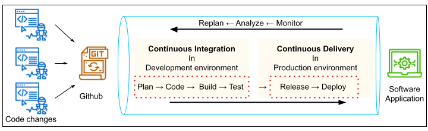

#### Lesson 1: Continues Integration and Continues Deployment

#### 2. Course Overview

Course Objectives
In this course, you will learn the fundamentals of Continuous Integration and Continuous Deployment (CI/CD) subject matters, such as Jenkins, Pipelines, Prometheus, and Ansible. After completing the course, you will be able to:

- Explain the fundamentals of CI/CD and Jenkins as a framework to achieve automation in CI/CD. Lesson 1 introduces Jenkins for building, testing, and delivering or deploying software.
- Make use of various Jenkins Plugins and Deployment Strategies to boost your CI/CD requirements. Lesson 2 will demonstrate to install and configure Blue Ocean, Aqua MicroScanner plugins for CI/CD pipeline. It will discuss several Deployment Strategies, as well.
- Utilize Ansible as a configuration management tool. Lesson 3 describes the basics of Ansible, such as Templates, Services, Conditionals, and Roles. It will demonstrate to run Ansible to provision the target infrastructure using code (infrastructure as code) .
- Make use of monitoring and log aggregation tools. Lesson 4 will guide you to install, configure, and use the Prometheus tool and ELK services.

Project Overview
The end of this course will lead to a project where you can show your acquired skills taught in this course. In our project, you will deploy and run an instance on AWS, configure Jenkins, and create a pipeline to deploy a static website on S3.

Lesson Objectives
After completing this lesson, you will be able to:

- Explain the fundamentals of CI/CD and pipelines
- Setup the prerequisites for Jenkins, such as AWS IAM user, EC2 instance, and S3 services
- Install and configure Jenkins as automation server to build a pipeline
- Describe the role of Jenkinsfile
- Install Blue Ocean plugin into Jenkins

#### 4. What is CI/CD and a Pipeline?

Background - What is DevOps?
We have learned in the previous course that DevOps is the combination of industry best practices, and set of tools that improve an organization’s ability to: \*Increase the speed of software delivery

Increases the speed of software evolution
Have better reliability of the software
Have scalability using automation,
Improved collaboration among teams. The two most important practices are - Continuous Integration / Continuous Delivery or Deployment (CI/CD) and Infrastructure as Code (IaaC).

What is CI/CD?
CI/CD is a consistent and automated way for a DevOps team to build, package, test, and deploy applications

- Continuous Integration means newly developed code changes of a project are periodically built, tested, and integrated into a shared repository like Git. Then, the integrated code is verified and tested using automated tools.

- Continuous Delivery is the process of automating the release of the merged and validated code to a repository and finally release a production-ready build to the production environment.


**Pipelines Overview**
One of the key best practices of DevOps is to be able to do “Infrastructure as Code”. A Pipeline enables us to store our Jenkins project configuration as code in a Git repository. A Pipeline is a set of tools and processes to automate the CI/CD.

The previous way of doing this was to store the configurations as text on the Jenkins server. However, it is far superior to store this in a Git repository, because that way we version it, review it, perform pull requests, and integrate it just like the rest of our code.

A pipeline contains steps that have different actions performed as part of those steps. Pipelines are written in Groovy code and designed to be reusable. Pipelines can be used similarly to how programming languages use “Modules” in a pluggable manner. The value in a Pipeline is it enables advanced functionality above and beyond simple Bash scripting. There are additional programmatic controls such as try and catch. A try/catch block creates a means of responding to errors in code or data for Jenkins functions. Pipelines assist with performing code testing and verification due to their modular nature and try/catch routines. This enables advanced error handling which lends itself to complex functionality.



As shown in the figure above, CI/CD pipeline implementation is the backbone of the modern DevOps environment. With pipelines we are able to use code checked into a Git repository to control the execution, linting, security testing, and performance testing of code. We use different environments to perform different functions, such as - development environment for building the code, staging environment for testing, and production environment for deployment.

### 8. Jenkins Intro

What is Jenkins?
To "expedite" the software development process, CI/CD has become an essential practice for rapid building, testing, and deployment. Jenkins is an automation server that is used to automate the tasks associated with CI/CD, such as building, testing, and deploying the application.

Jenkins comes originally from the Hudson project, which had very similar features and functionality but was controlled by Sun Microsystems. Jenkins is an open-source tool that was released in 2011. Jenkins is written in Java language. The prime feature of Jenkins is Jenkins Pipeline.

What is Jenkins Pipeline?
In general, a Pipeline is a set of tools and processes to automate the CI/CD of a software application. Jenkins Pipeline is a set of plugins that assist in achieving continuous delivery. Jenkins is highly modular and supports a multitude of plugins. Plugins extend Jenkins with additional features to support various requirements. We will cover a few of the plugins at a higher level in the next lesson.

**Jenkinsfile**
`Jenkinsfile` is a text file that contains the definition of a Jenkins Pipeline. This text file is stored into the application’s Source Control Repository e.g., Github. Storing the Jenkinsfile into a source control repository makes it possible to review and audit collaboratively. A Jenkinsfile can be written using two types of syntax - Declarative and Scripted. In this course, we will use the Declarative way to write `Jenkinsfile` .


Recommended Read
Jenkins provides Guided Tours, Tutorials, and Handbook documentation.
Read the [handbook documentation for Pipeline](https://jenkins.io/doc/book/pipeline/). The snapshot below highlights the topics that would provide insight into the Pipeline.
We suggest to read the Handbook first, and then go through the last two tutorials - “Create a Pipeline in Blue Ocean” and “End-to-End Multibranch Pipeline Project Creation”, later in this course.

AWS Pipeline Service [OPTIONAL TO READ]
AWS offers a CI/CD pipeline service, named as “CodePipeline”. This service can be used to model, visualize, as well as automate the steps required to release software. AWS CodePipeline enables us to increase the speed and quality of our development. It also runs a set of quality checks to ensure consistency. As a part of our project, we will need to provision (spinning-up) VMs in the cloud and use the service(s) of AWS.

AWS CodeBuild and AWS CodeDeploy are the two most relevant services that are useful as a part of DevOps. AWS offers a plethora of other services, and you can see an implementation guide to set up a CI/CD pipeline on AWS [here](https://aws.amazon.com/getting-started/projects/set-up-ci-cd-pipeline/?trk=gs_card).

#### 9. Connect to EC2 Instance using SSH

Unix/Linux/Mac users
Unix/Linux/Mac users can log into your EC2 instance using Secure Shell (SSH) client. The following are the steps:

1. Open an SSH client.
2. Locate the private key .pem file in your local machine, and change the permissions to hide it from public for SSH to work, using the command
   `chmod 400 <path of private key .pem file locally>`
3. The default username for Ubuntu VMs is ‘ubuntu@` . Note the public IP address or public DNS of your EC2 instance. See the snapshot below to determine the public IP and DNS of your EC2 instance.
4. Connect to your instance using its public IP address, using `ssh ubuntu@3.86.197.149 -i <path of private key .pem file locally>` in your terminal. Alternatively, you can use the public DNS, as `ssh -i <path of private key .pem file locally> <public DNS>`.

#### 10. Install

Commands for Installing Jenkins on an EC2 instance

```sh
# Step 1 - Update existing packages
sudo apt-get update

# Step 2 - Install Java
sudo apt install -y default-jdk

# Step 3 - Download Jenkins package.
# You can go to http://pkg.jenkins.io/debian/ to see the available commands
# First, add a key to your system
wget -q -O - https://pkg.jenkins.io/debian/jenkins.io.key | sudo apt-key add -

# # Step 4 - Add the following entry in your /etc/apt/sources.list:
sudo sh -c 'echo deb https://pkg.jenkins.io/debian-stable binary/ > /etc/apt/sources.list.d/jenkins.list'

# # Step 5 -Update your local package index
sudo apt-get update

# Step 6 - Install Jenkins
sudo apt-get install -y jenkins

# Step 7 - Start the Jenkins server
sudo systemctl start jenkins

# Step 8 - Enable the service to load during boot
sudo systemctl enable jenkins
sudo systemctl status jenkins
```
