### Lesson 1: Networking

#### 2. Lesson Map & Learning Objectives

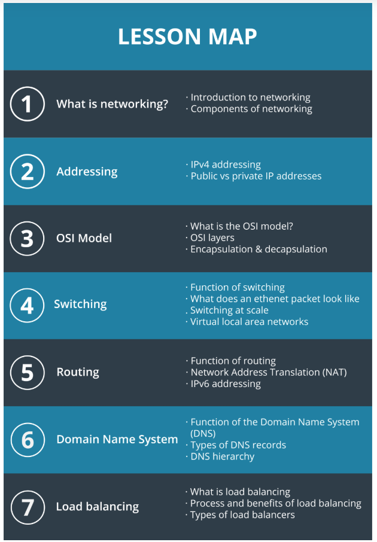

Learning Objectives

- Explain how all components of a network function together to deliver packets from one device to another device, which could be on the other side of the world.
- Determine whether an IP address is public or private.
- Understand how the IPv4 address shortage is solved with NAT and IPv6.
- Calculate the network address and subnet size given the address of one device on the network, and the subnet mask.
- List the layers in the OSI Model
- Describe how data moves down the layers in the OSI Model in a process called Encapsulation
- Describe how data moves up the layers in the OSI Model in a process called Decapsulation
- Diagram how data moves from the sending device and across a network to the target device
- Recommend an appropriate switching architecture for a particular network size.
- Use the Wireshark network analysis tool to extract address, FQDN, and DNS information from real network packet transmissions
- Explain how the DNS server resolves an FQDN query to an IP address
- Explain how load balancing works and the different ways of balancing the load of incoming network traffic

#### 3. Network Communication Model

Three main components of networking

- Medium: i.e. How are you connected.
- Addressing: How do you locate and identify the other party.
- content: What information are you sharing with the other party.

#### 4. Addressing

2 IP standards are used: IPv4 and IPv6
IPv4: A 32-bit value. For example: `192.168.112.20`. This format is for human readability, for computer, it will be translated into binary - `11000000.10101000.01110000.00010100`

2 to the power of 32 = 4.294.967.296 (4 billion) IP addresses, already fewer than the people living on the earth. Besides there are some IP addresses are reserved for private addressing, testing, documentation and other services. In total, 1/8 IP addresses are unavailable for public addressing.


- The pink squares (0, 10, and 127) are blocks that are entirely reserved.
- The blue squares are blocks that are partially reserved. For instance, not all of the 192 block is reserved, but some of it is.
- The entire green row (starting at 224) is set aside for IP multi-cast.
- And the entire orange bottom row (starting at 240) was originally set aside for "future use" but was effectively lost due to being `blocked as invalid`.

Private IP addresses often reside on 10.0.0.0/8, 172.16.0.0/12, and 192.168.0.0/16, with the most common of all being, 192.168.0.0/24 (with a default gateway of 192.168.0.1).

#### 5. Addressing and Networks

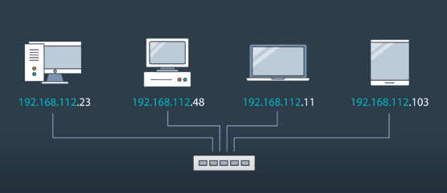

The devices on the same network are sharing a common prefix, like the pic above, they are sharing the common '192.168.112' prefix.

Devices on the same network can communicate to each other without needing a router.

**A network with longer prefix will have less IP address**


In above example, a /24 network, the first 24 bits are dedicated toward the prefix, and 8 bits are left for addressing.

2 to the power of 8 is 256, and first & last IP address (.0 and .255) are reserved, plus commonly the second IP address (.1) is used for router, so effectively only 253 IP addresses are left for addressing in a /24 network


In above example, a /16 network, the first 16 bits are dedicated toward the prefix, and 16 bits are left for addressing.

2 to the power of 16 is 65,536, and first & last IP address (.0 and .255) are reserved, plus commonly the second IP address (.1) is used for router, so effectively only 65,5363 IP addresses are left for addressing in a /24 network

The format we are using, IP address and a length of prefix (192.168.11.10/24). This notation is called `classless inter-domain routing`, or `cidr` for short, it contains a IP address and the subnet mask.

One device may want to know if another device is on the same network, we need to do the following calculation:
for example IP address 192.117.66.237/22

- we firstly convert IP to binary
- then we put subnet mask in binary, underneath IP binary
- then do a logical AND operation
- then convert the result back to IP address (192.117.64.0), 192.117.64.0 is the first address in this network block
  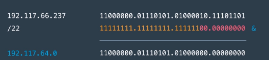
- to find the full range of addresses that belongs to this network, we know the last 2 bits of the third octet are free, which means that there are four different values that the third octet can take, they are 64, 65, 66 and 67

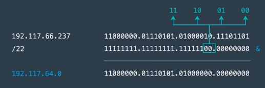


There are 2 online tools for [IP Address to Binary](https://www.browserling.com/tools/IP-to-bin) and [Binary to IP Address](https://www.browserling.com/tools/bin-to-IP)

Practice:

```
122.48.253.2/18
122.48.253.2 is 01111010.00110000.11111101.00000010
         /18 is 11111111.11111111.11000000.00000000   AND
                01111010.00110000.11000000.00000000
                which is 122.48.192.0/18

There are six bits in the third octet are free, so from 122.48.192.0 - 122.48.255.255 are belongs to this network block
```

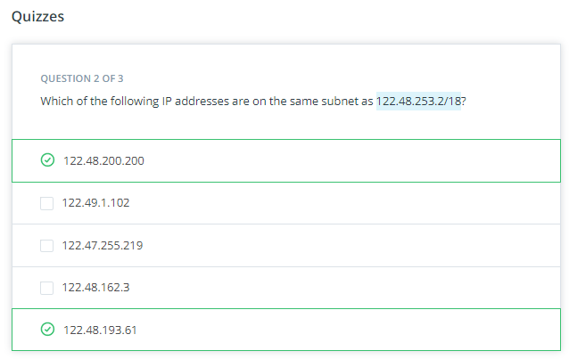

```
172.254.3.17/8
172.254.3.17  is  10101100.11111110.00000011.00010001
          /8  is  11111111.00000000.00000000.00000000   AND
                  10101100.00000000.00000000.00000000
                  which is 172.0.0.0/8
```

#### OSI Model

Richard and Julia are trying to communicate over a tin can phone. Earlier, you learned that there are three main components in a network: the medium, the addressing, and the content. In this tin can phone example, the medium is the cord connecting the phones together. We're already directly connected to each other so we don't have to worry about the addressing, and the content is what we're trying to tell each other.

Let's take a moment to think about how we communicate the content to each other. For example, how does Richard know when Julia is finished talking so that he can reply? It would make communication a lot easier if `they both agreed on a set of procedures to do each time they start and stop talking`. For example, before sending her main message, Julia could begin the communication channel by saying "Message is starting". Then, so that Richard knows she's finished communicating her message, Julia, when finished sending the content of her message, could follow up with "Message is finished".

This is a simple example, but the important thing here is that `these set of procedures are` **protocols**, `and they can be used to help standardize communication across a network`. If two computers are trying to send a message across a network, how should the two computers communicate effectively and efficiently? What sort of protocols should they use to make sure their messages are sent and received correctly? There can be many, many more devices than just these two computers. In this internet-connected world, virtually anything can be a network device!

So with the flourishing ecosystem of vendors (e.g. different manufacturers, different devices, etc.), we need to ensure the interoperability of both devices and the medium across which these devices communicate so that network communication can function effectively.

How can we ensure that any device can send any kind of message across any kind of medium to some other device? Well, we need a standard that all parties can agree upon so that communication across a network can occur. In fact, as you might expect, we'd need a lot of standards for this to occur. `There are standards for cables, their connectors, how data is packaged, how one device knows when to send to another device, how data is converted to electrical signals, how messages are broken up into chunks, how two devices are able to send an error-free message, and so on.` There are many standards for all of the different parts of network communication.

And this brings us to the **OSI model**! OSI stands for **Open Systems Interconnection**
The OSI model is a breakdown of the various aspects of network communication. It is concerned with the ability of different systems to be connected with each other.

It's a conceptual breakdown of all the parts that are involved and groups them into logical sections.

##### Layers in the OSI Model

This is a conceptual model for a network system to handle communication, mainly how devices connect to networks, and how data is sent across a network; it's not a concrete example of how network communication happens.

You don't need to memorize this information. Instead, you should focus on absorbing how the layers are arranged. Later, you'll study these layers in more detail.

There are 7 layers in the OSI model. We'll start at the top-most layer, layer 7, and work our way down to layer 1.

Layer 7 - Application
Layer 6 - Presentation
Layer 5 - Session
Layer 4 - Transport
Layer 3 - Network
Layer 2 - Data Link
Layer 1 - Physical


For example, network devices can be grouped at several different layers in the OSI model. Layer 1 of the OSI model deals with the physical and electrical specification for devices. Items such as physical cables, wireless signless, the network identification card (NIC) inside a computer are all grouped at the Layer 1 level. But even though Layer 1 is called the physical layer, that doesn't mean that every physical device shows up there. For example, a switch is a Layer 2 device and a router is a Layer 3 device.

The OSI Model also helps group network protocols together. Here are some of the most common protocols at each layer:

Layer 7 = HTTP
Layer 6 = SSL and TLS
Layer 5 = socket
Layer 4 = TCP and UDP
Layer 3 = IP and ICMP
Layer 2 = ARP
Layer 1 = 1000BASE-T, DSL, DOCSIS, 802.11a/b/g/n
The information that goes along with the OSI Model is vast and deep, and we're not going to go into more detail on the standards and protocols than we have right here. I just want you to be aware of another aspect of the OSI model and to see from another perspective how it is a conceptual model to help group information.

##### Sibling Dependence

In the OSI model, **a layer is only concerned with the layers above and below it**. For example, layer 3 (the Network layer) is only concerned with the two layers that are on either side of it:

```
Layer 4 - the Transport layer
Layer 2 - the Data Link layer
Layer 3 will receive data from Layer 4 and send it to Layer 2 or it will receive data from Layer 2 and send it to Layer 4.
```

```
Layer 7 (the Application layer) is at the very top of the OSI model. Since it is at the top, it is only concerned with sending data to Layer 6 (the Presentation layer) or receiving data from Layer 6.
```

A single layer does not need to know the whole path that data takes through the OSI model. It just need to know about the layers above and below it that it needs to interact with. Now, why is this important? Each layer in the OSI model is an abstraction layer. An abstraction layer is **a way of hiding the working details of a subsystem**

For example, the way that the data is formatted, processed, and changed in Layer 2 does not matter to Layer 4, because Layer 3 abstracts those implementation details away. All Layer 4 has to worry about is how it needs to receive data from Layer 3 - it doesn't have to worry about the specifics of Layer 2 (since that's Layer 3's job).

#### Encapsulation and Decapsulation

Layer 3 will receive data from Layer 4 and send it to Layer 2 or it will receive data from Layer 2 and send it to Layer 4.

When does data move down the layers from Layer 4 to Layer 3 to Layer 2 and when does the data move up the layers from Layer 2 to Layer 3 to Layer 4? These two processes are called encapsulation and decapsulation.

Remember that the OSI model is a conceptual model of how data is packaged and sent across a network to another device. In this scenario, let's assume that there are only two devices that are trying to communicate with each other. The OSI model is used on both devices.

As the data is being packaged up on a _sending_ device, the data moves _down_ the OSI model; this process of the data moving down the OSI model is called **encapsulation**.

When the data is being unpacked on a _receiving_ device, the data moves _up_ OSI model; this process of the data moving up the OSI model is called **decapsulation**.

Let's see each of these in more detail. First, we'll start with encapsulation.
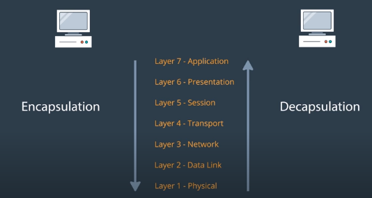

**Encapsulation** is happening on the **sending** devices.

Each above layer will add some header(control information) to the data, and pass it down to lower layer. (except for 2 layers, layer 2 will not ONLY prepend control information to the header, but also to the trailer. layer 1 has no data but electrical signals)

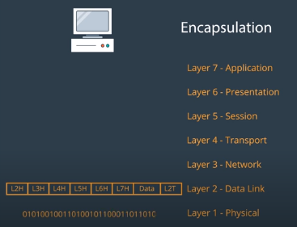

**Decapsulation** is happening on **receiving** devices.

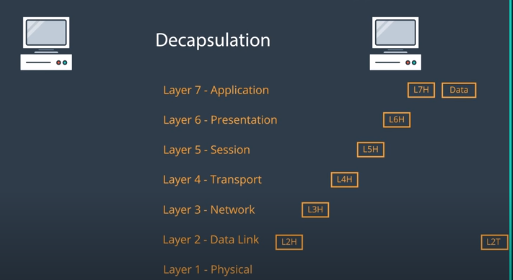

To recap, when data travels down the OSI model, the data from a higher layer becomes the "payload" for a lower layer. When the data moves from a higher layer to a lower layer, the data is wrapped in new information called a "header" and a "footer". This is where it gets the name "encapsulation"; because the data is wrapped (or encapsulated) with new header/footer layers.

Conversely, the opposite happens when traveling up the OSI model. As the data moves up the OSI model, these header/footer layers are removed. This is where it gets the name "decapsulation".

#### Network Transmission

You saw how encapsulation works on the sending device. Then you saw how decapsulation works on the destination device. We looked at both of these in isolation so that we could zoom in on exactly what's going on with encapsulation and decapsulation. But now, let's zoom back out a bit and see how data moves from one device to another in a network.

To recap, as data moves across a network, each devices looks at specific header information to determine if the data belongs to itself or if it should forward the data on to another device. One thing to note here is that this process of moving up and down the OSI model (the process of encapsulation and decapsulation) happens over and over as the data moves from one device to another. To clarify, though, `the information doesn't move all the way up through all of the OSI layers at each device, it only does that at the final (target) device.`

Start: Computer A wants to send some data to computer B, which is located in a different network. So a router will be involved.
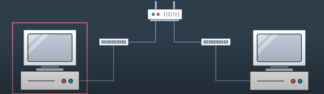

Step 1:
Computer A encapsulate the data, convert it to electrical signals, and send it out on the wire.
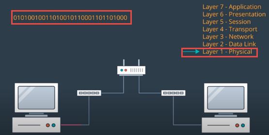

Step 2:
A switch receives the signal. It will decapsulate it into layer 2 data, and looks at the layer 2 header, the data is reaching to reach is a router. So the switch encapsulate the data, and send it out to the router.
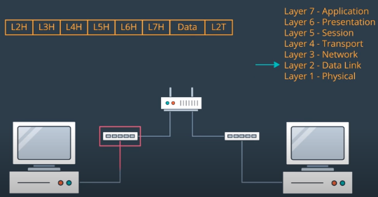
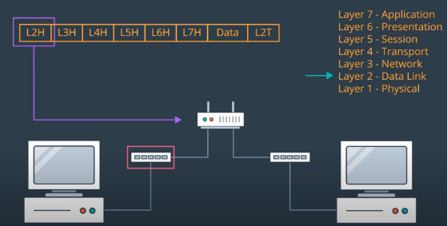

Step 3:
The router receives the signal. It will decapsulate it into layer 2 data, and looks at the layer 2 header, the data is reaching to reach is the router itself.

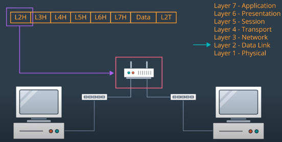

So the router removes the layer 2 header, and send it to layer 3. The layer 3 header indicates the destination device is computer B. so the router encapsulate the data, and send it on the wire again, with a new layer 2 header.
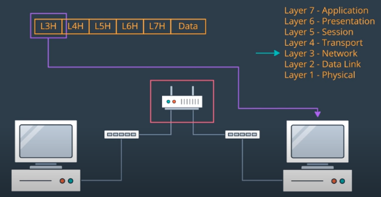

Step 4:
A switch receives the signal. It will decapsulate it into layer 2 data, and looks at the layer 2 header, the data is reaching to reach is computer B. So the switch encapsulate the data, and send it out to the router.
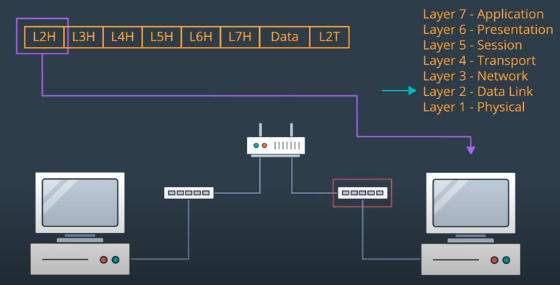

Step 5:
Computer B receives the data. It will decapsulate it into layer 2 data, and looks at the layer 2 header, the data is reaching to reach is computer B itself. So the decapsulate the data, and send it all the way up to application level, and control header information are removed one by one.

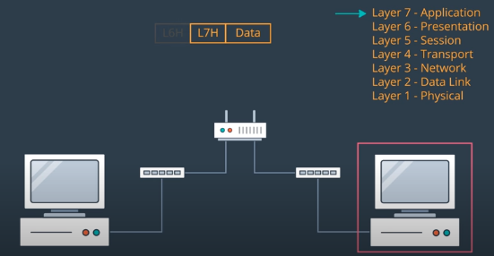

##### Summary

In this section we looked at the layers of the OSI model, how data moves down the OSI model on a device, how it moves across a network, and how data moves _up_ the OSI model on the target device.

The OSI Model layers are:

Layer 7 - Application
Layer 6 - Presentation
Layer 5 - Session
Layer 4 - Transport
Layer 3 - Network
Layer 2 - Data Link
Layer 1 - Physical
The process of data moving down the layers is called encapsulation. The process of data moving up the layers is called decapsulation.

#### 7. Switching

A switch operates on layer 2 of the OSI model, so it uses each devices MAC address for the purpose of addressing.
A switch manages the data flow in a local area network(LAN). Local area network means there is one single network subnet, and one broadcast domain. And there are no layer 3 devices such as a router to connect this network with the outside network.
An ethernet switch is responsible for directing the flow of traffic to a specific recIPient, or multIPle recIPients.
It also has additional roles such as buffering and managing transmission speeds.
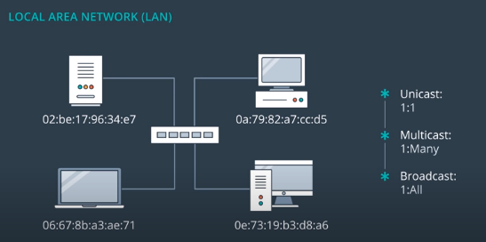`

#### 8. Frame Structure

An layer 1 Ethernet packet contains an Layer 2 Ethernet Frame
Layer 2 Ethernet Frame contains important information, such as the source MAC and destination MAC, and payload, which contains all information from its above layers.
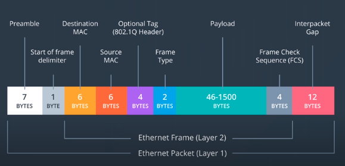

#### 9.Switching At Scale

Previously we had a look of how a single switch is working

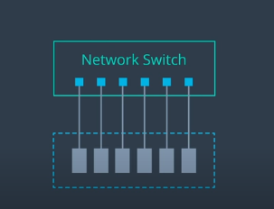

When the ports on a single switch is not enough, then we can link multIPle switches together, using a special links called "trunk links". **trunk links** are a collection of wires that simultaneously carry multIPle frames from one switch to another.

This will create a much larger LAN, but still one subnet, and one broadcast domain.
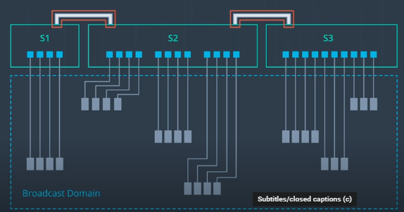

As a LAN grows in size, the volume of broadcast data grows as well. To resolve this issue, there are 2 solutions:

1. Subnetting:

   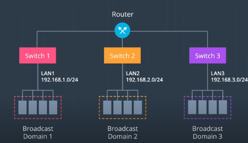

2. Virtual LANs (VLANs)

   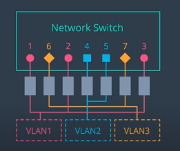

   Creating multIPle Virtual LANs on a single switch.

### Virtual LANs

VLANs logically segment a network into distinct LANs. VLANs users software as opposed to hardware to separate individual devices into separate networks.

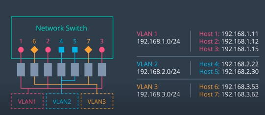

Each of these VLANs is its own subnet, within its own broadcast domain, even though they are sharing a single physical switch.

The physical switch accomplishes this logical segmentation by associating each of its ports with the appropriate VLAN.

VLAN can be easily scale up by adding more switches using truncate links
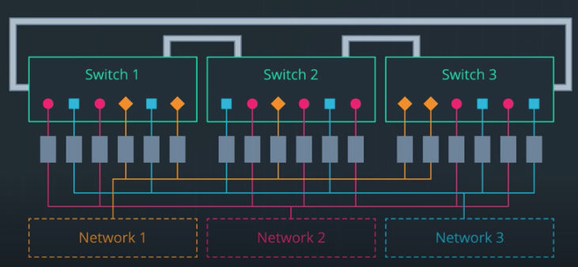

#### 11. Routing

The core function of a router is to decide where to forward packets.

Router receives a packet, it will examine the destination IP address, and perform a routing table lookup

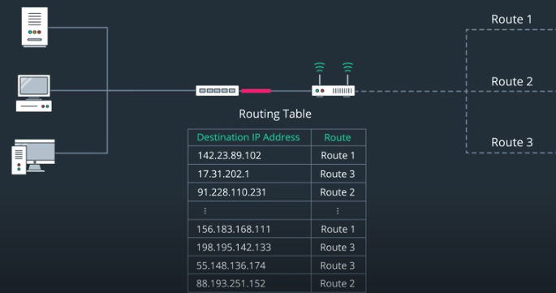

If a matching recording is found, then the routing will direct the traffic to the known destination. Otherwise the packet will be dropped, and router will send an error message to the sender.

Solutions to IPv4 Address Exhaustion

1. Private IP Addresses
2. Network Address Translation (NAT)

NAT is responsible for translating your private IP address to Public IP address
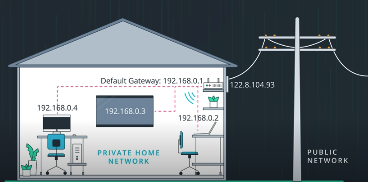

The www is not a huge single network. It is a network consists of lots of private networks.
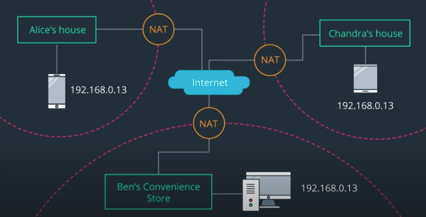

However, NAT is a patch to IPv4, it is adding complexity to IPv4 system.

The real solution is the IPv6, which has 128-bit address. And the smalltest network block can be assigned to end user is 64 bits, which is already bigger than the entire IPv4 network.

##### Your Private IPv4 Address

To find your private IP address, you can use a terminal. Depending on which OS (Operating System) you are running, the command to determine your IP address will differ. On a Linux or Mac, type in ifconfig, whereas on a Windows computer, type in IPconfig to find your IP address. The result may look like so,

```
Ethernet adapter Ethernet:

Connection-specific DNS Suffix . :
Link-local IPv6 Address . . . . . : fe80::14a5:92a8:6620:114a%4
IPv4 Address. . . . . . . . . . . : 192.168.50.197
Subnet Mask . . . . . . . . . . . : 255.255.255.0
Default Gateway . . . . . . . . . : 192.168.50.1
```

Often, running this command will return not one, but a number of network interfaces. Ethernet interfaces will be labelled `eth0`, `eth1`, etc., while Wi-Fi interfaces are often labelled `wlan0`, `wlan1`, on so on. A Mac may return an especially large number of network interfaces, as it uses a number of loopback interfaces (interfaces that the OS uses to communicate with itself).

Private IP addresses often reside on 10.0.0.0/8, 172.16.0.0/12, and 192.168.0.0/16, with the most common of all being, 192.168.0.0/24 (with a default gateway of 192.168.0.1).

#### 12. Wireshark

Wireshark capture network packets and display them in a GUI as much detail as possible.

#### 13. Domain Name System (DNS)

Fully Qualified Domain Name (FQDN)
A Fully Qualified Domain Name (FQDN) consists of three parts - the hostname, domain, and top-level domain (TLD). The format looks like so,

[host name].\[domain\].\[tld\]

For the FQDN www.udacity.com - www is the hostname, udacity is the domain, and com is the top-level domain.

When the request come to resolve the host name FQDN to an IP address, the authority of DNS server will look it up in its database.
DNS server belongs to Layer 7 Application level, since applications often need to use host names.

#### 14. Types of DNS Records

When you type in an FQDN or hostname into your browser and hit enter, your browser checks its local cache to see if it knows which IP address corresponds to this FQDN. If no result is found, then the browser queries against an authoritative DNS server for the IP address associated with that FQDN.
